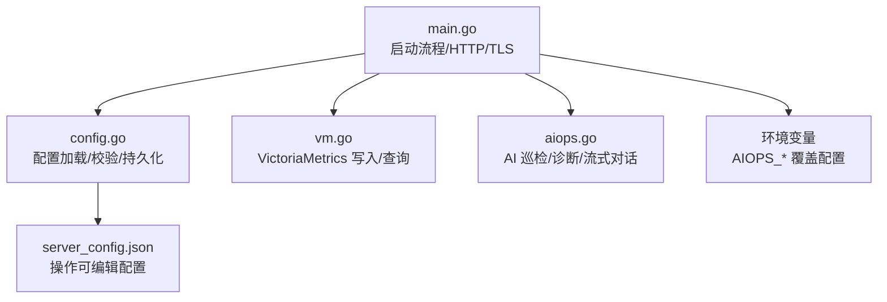
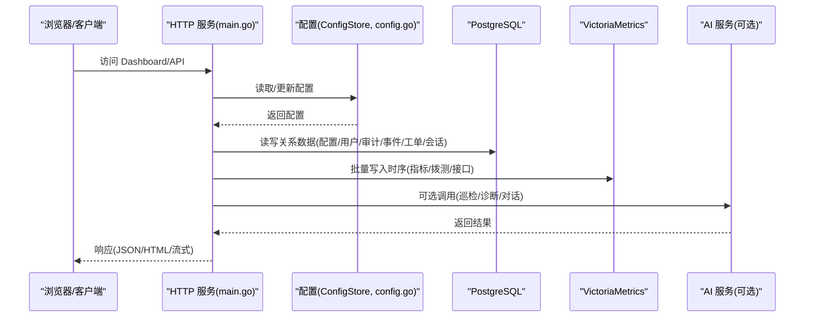
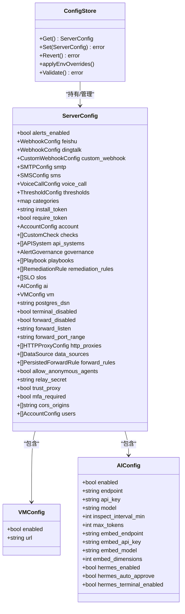

# 服务端配置

<cite>
**本文引用的文件**   
- [cmd/server/config.go](file://cmd/server/config.go)
- [cmd/server/main.go](file://cmd/server/main.go)
- [cmd/server/vm.go](file://cmd/server/vm.go)
- [cmd/server/aiops.go](file://cmd/server/aiops.go)
- [server_config.example.json](file://server_config.example.json)
- [config.example.json](file://config.example.json)
- [docker/Dockerfile](file://docker/Dockerfile)
</cite>

## 目录
1. [简介](#简介)
2. [项目结构](#项目结构)
3. [核心组件](#核心组件)
4. [架构总览](#架构总览)
5. [详细组件分析](#详细组件分析)
6. [依赖关系分析](#依赖关系分析)
7. [性能与容量规划](#性能与容量规划)
8. [故障排查指南](#故障排查指南)
9. [结论](#结论)
10. [附录：配置项参考与示例](#附录配置项参考与示例)

## 简介
本文件面向运维与平台工程师，系统化说明 server_config.json 的所有配置项及其与环境变量、启动参数的联动关系。重点覆盖：
- 数据库连接（PostgreSQL）与时序存储（VictoriaMetrics）
- HTTP 服务与安全（TLS/HTTPS、CORS、代理信任）
- 告警阈值与通知渠道（飞书、钉钉、自定义 Webhook、SMTP、短信、语音）
- 插件系统与拨测/接口监控
- AI 服务集成（OpenAI/Anthropic 兼容端点、嵌入/RAG、Hermes Agent）
并提供单节点、多节点集群、高可用等场景的完整配置建议与最佳实践。

## 项目结构
服务端主程序在 cmd/server 下，配置文件加载、校验、持久化逻辑集中在 config.go；运行时初始化、HTTP 服务器、TLS、外部依赖（PG/VM）在 main.go；时序写入与查询在 vm.go；AI 能力在 aiops.go。

图表来源
- [cmd/server/main.go:227-355](file://cmd/server/main.go#L227-L355)
- [cmd/server/config.go:407-489](file://cmd/server/config.go#L407-L489)
- [cmd/server/vm.go:1-40](file://cmd/server/vm.go#L1-L40)
- [cmd/server/aiops.go:27-45](file://cmd/server/aiops.go#L27-L45)

章节来源
- [cmd/server/main.go:227-355](file://cmd/server/main.go#L227-L355)
- [cmd/server/config.go:407-489](file://cmd/server/config.go#L407-L489)

## 核心组件
- 配置模型 ServerConfig：包含告警开关、通知渠道、阈值、账户、拨测、治理、SLO、AI、VM、PG、转发/终端开关、CORS、MFA 策略等。
- 配置存储 ConfigStore：线程安全读写、磁盘或 PG 持久化、默认值回填、环境覆盖、校验、回滚。
- 外部存储：
  - PostgreSQL：所有关系型数据（配置、用户、审计、事件、工单、会话等）。
  - VictoriaMetrics：全部时序指标（主机/拨测/接口探测），通过 /api/v1/import/prometheus 批量推送。
- HTTP 服务：支持 gzip、CORS、安全头、请求体限制、TLS/HTTPS。
- AI 层：可选 LLM 增强（OpenAI/Anthropic 兼容），含嵌入/RAG、Hermes Agent 开关。

章节来源
- [cmd/server/config.go:407-489](file://cmd/server/config.go#L407-L489)
- [cmd/server/config.go:533-599](file://cmd/server/config.go#L533-L599)
- [cmd/server/main.go:251-272](file://cmd/server/main.go#L251-L272)
- [cmd/server/vm.go:19-40](file://cmd/server/vm.go#L19-L40)
- [cmd/server/aiops.go:27-45](file://cmd/server/aiops.go#L27-L45)

## 架构总览

图表来源
- [cmd/server/main.go:294-355](file://cmd/server/main.go#L294-L355)
- [cmd/server/config.go:533-599](file://cmd/server/config.go#L533-L599)
- [cmd/server/vm.go:125-172](file://cmd/server/vm.go#L125-L172)
- [cmd/server/aiops.go:646-683](file://cmd/server/aiops.go#L646-L683)

## 详细组件分析

### 配置加载与优先级
- 启动参数：-addr、-config、-dist、-reset-admin、-reset-admin-api。
- 环境变量覆盖：AIOPS_* 优先于 JSON 文件字段（详见“环境变量覆盖”小节）。
- 持久化：优先从 PG 加载配置 blob，否则回退到本地 JSON 文件；保存时按权限 0o600 写盘。
- 默认值回填：阈值零值自动回填为内置默认，避免误触发。
- 校验：百分比范围、端口范围、密码长度等。

章节来源
- [cmd/server/main.go:227-244](file://cmd/server/main.go#L227-L244)
- [cmd/server/config.go:543-599](file://cmd/server/config.go#L543-L599)
- [cmd/server/config.go:502-531](file://cmd/server/config.go#L502-L531)
- [cmd/server/config.go:1046-1076](file://cmd/server/config.go#L1046-L1076)

### 环境变量覆盖（AIOPS_*）
以下环境变量会覆盖对应配置字段（若存在且非空）：
- AIOPS_VM_URL → vm.enabled=true, vm.url=值
- AIOPS_POSTGRES_DSN → postgres_dsn=值
- AIOPS_FORWARD_LISTEN → forward_listen=值
- AIOPS_FORWARD_PORT_RANGE → forward_port_range=值
- AIOPS_RELAY_SECRET → relay_secret=值
- AIOPS_FORWARD_DISABLED → forward_disabled=true/false
- AIOPS_TERMINAL_DISABLED → terminal_disabled=true/false
- AIOPS_ALLOW_ANONYMOUS_AGENTS → allow_anonymous_agents=true/false
- AIOPS_TRUST_PROXY → trust_proxy=true/false
- AIOPS_REQUIRE_TOKEN → require_token=true/false

注意：启动时会强制检查 AIOPS_POSTGRES_DSN 与 AIOPS_VM_URL，未配置则拒绝启动。

章节来源
- [cmd/server/config.go:616-651](file://cmd/server/config.go#L616-L651)
- [cmd/server/main.go:255-261](file://cmd/server/main.go#L255-L261)

### 存储后端（PostgreSQL + VictoriaMetrics）
- PostgreSQL（必填）
  - 用途：配置、用户、审计日志、事件、工单、会话、SRE 工作流等关系数据。
  - 配置方式：AIOPS_POSTGRES_DSN（推荐）或 postgres_dsn（JSON）。
  - 启动行为：连接失败重试若干次后仍失败则终止进程，无本地回退。
- VictoriaMetrics（必填）
  - 用途：全部时序数据（主机指标、拨测、API 性能）。
  - 配置方式：AIOPS_VM_URL（推荐）或 vm.enabled+vm.url（JSON）。
  - 写入路径：/api/v1/import/prometheus（Prometheus 文本格式），批处理、异步、丢包不阻塞采集。
  - 历史查询：/api/v1/export 拉取并按时间戳重组样本。

章节来源
- [cmd/server/main.go:251-272](file://cmd/server/main.go#L251-L272)
- [cmd/server/config.go:617-626](file://cmd/server/config.go#L617-L626)
- [cmd/server/vm.go:19-40](file://cmd/server/vm.go#L19-L40)
- [cmd/server/vm.go:125-172](file://cmd/server/vm.go#L125-L172)
- [cmd/server/vm.go:714-742](file://cmd/server/vm.go#L714-L742)

### HTTP 服务与安全
- 监听地址：-addr（默认 :8529），Docker 镜像暴露 8529。
- TLS/HTTPS：当设置 AIOPS_TLS_CERT 与 AIOPS_TLS_KEY 时启用 HTTPS；否则以明文 HTTP 运行并输出警告。
- CORS：cors_origins 为空时兼容旧版 *；配置白名单后仅允许匹配 Origin。
- 安全头：X-Content-Type-Options、X-Frame-Options、Referrer-Policy、CSP（除 /proxy/*）。
- 请求体限制：最大 100MiB，防止内存耗尽。
- 压缩：对非 WS/非代理/非终端/非转发的文本响应启用 gzip。
- 代理信任：trust_proxy=false 默认，避免伪造 X-Forwarded-For 绕过限流。

章节来源
- [cmd/server/main.go:294-355](file://cmd/server/main.go#L294-L355)
- [cmd/server/config.go:470-485](file://cmd/server/config.go#L470-L485)
- [docker/Dockerfile:54-59](file://docker/Dockerfile#L54-L59)

### 通知渠道与告警阈值
- 通知渠道
  - 飞书/钉钉：enabled/webhook/secret（钉钉 HMAC-SHA256）。
  - 自定义 Webhook：method/content_type/headers/body_template。
  - SMTP：smtp_enabled/host/port/username/password/from_name/use_tls。
  - 短信/语音：provider/access_key/secret_key/app_id/sender/region/sign_name/template_code/phones/called_numbers/tts_code/tts_param 等。
- 阈值 Thresholds
  - CPU/Mem/Disk/DiskIO/IOPS/GPU/Load/Proc/Conn 等告警阈值，以及离线检测超时。
  - 拨测阈值：Ping 丢包/延迟、TCP 超时、HTTP 响应/状态码、进程存活失败次数。
  - API 业务阈值：可用率、平均/P95 响应、吞吐量。
  - 编排任务阈值：失败次数、超时时长。
  - 端口转发阈值：活跃连接、带宽、错误率、延迟。
  - 验证规则：百分比 0-100，离线超时 >0，SMTP 端口 1-65535，密码长度≥4。

章节来源
- [cmd/server/config.go:15-135](file://cmd/server/config.go#L15-L135)
- [cmd/server/config.go:137-172](file://cmd/server/config.go#L137-L172)
- [cmd/server/config.go:502-531](file://cmd/server/config.go#L502-L531)
- [server_config.example.json:1-36](file://server_config.example.json#L1-L36)

### 账户、认证与 MFA
- 安装令牌：install_token 用于 Agent 注册；支持轮换（保留旧令牌宽限期）。
- 强校验：require_token=true 强制 Agent 携带令牌；allow_anonymous_agents=false 默认禁止匿名。
- 账户：account.users（RBAC：admin/operator/viewer），支持 TOTP 二次认证（mfa_enabled/mfa_secret）。
- 全局 MFA 策略：mfa_required 强制未开启 MFA 的用户下次登录时完成绑定。
- 终端二次密码：terminal_password_hash/salt（独立于登录密码）。

章节来源
- [cmd/server/config.go:317-350](file://cmd/server/config.go#L317-L350)
- [cmd/server/config.go:419-489](file://cmd/server/config.go#L419-L489)
- [cmd/server/config.go:807-851](file://cmd/server/config.go#L807-L851)

### 端口转发与远程终端
- 端口转发
  - forward_disabled=false 默认开启；forward_listen 默认 127.0.0.1（容器内需改为 0.0.0.0）；forward_port_range 默认 10100-10300。
  - 支持 TCP/UDP，规则持久化并可启停。
- 远程终端
  - terminal_disabled=false 默认开启；会话录制落库（PG），支持回放与只读观察。
  - 中继模式：relay_secret 用于上游校验中继请求。

章节来源
- [cmd/server/config.go:437-475](file://cmd/server/config.go#L437-L475)
- [cmd/server/config.go:710-745](file://cmd/server/config.go#L710-L745)

### 插件系统
- 插件目录：plugins_dir（Agent 侧配置，见 agent 配置参考）。
- 执行周期：plugin_interval（秒）。
- 插件协议：标准输出 JSON（base/metrics/events），崩溃/超时不影响核心。

章节来源
- [config.example.json:1-16](file://config.example.json#L1-L16)

### 拨测与 API 性能监控
- 自定义拨测 checks：http/tcp/ping/process，支持高级 HTTP（方法/头/体/期望状态/关键字/JSONPath/证书剩余天数）。
- API 性能监控 api_systems：按业务系统分组批量探测接口，结果写入 VM 并聚合展示。

章节来源
- [cmd/server/config.go:352-389](file://cmd/server/config.go#L352-L389)

### AI 服务集成
- AIConfig
  - enabled/endpoint/api_key/model：OpenAI 兼容或 Anthropic Messages API。
  - inspect_interval_min/max_tokens：巡检间隔与输出上限。
  - embed_endpoint/embed_api_key/embed_model/embed_dimensions：嵌入/RAG 向量维度（默认 1536，须与 pgvector 一致）。
  - hermes_enabled/hermes_auto_approve/hermes_terminal_enabled：Hermes Agent 自主执行与只读巡检开关。
- 使用方式：巡检报告、事件诊断、SSE 流式对话；未配置时走启发式引擎。

章节来源
- [cmd/server/aiops.go:27-45](file://cmd/server/aiops.go#L27-L45)
- [cmd/server/aiops.go:646-683](file://cmd/server/aiops.go#L646-L683)
- [cmd/server/aiops.go:180-222](file://cmd/server/aiops.go#L180-L222)

## 依赖关系分析

图表来源
- [cmd/server/config.go:407-489](file://cmd/server/config.go#L407-L489)
- [cmd/server/config.go:533-599](file://cmd/server/config.go#L533-L599)
- [cmd/server/vm.go:30-34](file://cmd/server/vm.go#L30-L34)
- [cmd/server/aiops.go:27-45](file://cmd/server/aiops.go#L27-L45)

## 性能与容量规划
- 时序写入
  - VM 写入采用批量与缓冲队列，超时丢弃以避免阻塞采集；建议 VM 具备足够吞吐与磁盘 I/O。
  - 指标族包括主机、拨测、API 三类，标签维度较多（host/instance/category/check_id/system/endpoint 等），需评估 cardinality。
- HTTP 服务
  - 启用 gzip 可降低仪表板轮询带宽；CSP/安全头提升安全性但可能影响第三方资源加载。
- 存储
  - PG 承载关系数据，建议合理索引与分区策略；VM 负责长尾时序，建议冷热分层与保留策略。
- 并发与缓冲
  - VM 写入缓冲较大（主机 8192、拨测/接口 4096），在高上报频率下可减少 GC 压力。

章节来源
- [cmd/server/vm.go:75-77](file://cmd/server/vm.go#L75-L77)
- [cmd/server/vm.go:125-172](file://cmd/server/vm.go#L125-L172)
- [cmd/server/main.go:147-205](file://cmd/server/main.go#L147-L205)

## 故障排查指南
- 启动失败
  - 未配置 AIOPS_POSTGRES_DSN 或 AIOPS_VM_URL：启动直接报错退出。
  - PG 连接失败：重试多次后终止，检查网络、鉴权、sslmode 等。
- 配置无法生效
  - 确认环境变量是否覆盖了 JSON 字段；某些字段由专用 API 管理（如 Users、AI、VM、PG DSN 等），表单保存不会覆盖。
- 告警阈值异常
  - 阈值为 0 会被回填为默认值；百分比必须在 0-100；离线超时必须 >0；SMTP 端口 1-65535，密码长度≥4。
- 端口转发不可达
  - Docker 部署需将 forward_listen 设为 0.0.0.0；检查 forward_port_range 与防火墙。
- TLS/HTTPS
  - 未配置 AIOPS_TLS_CERT/AIOPS_TLS_KEY 将以明文 HTTP 运行并输出警告；生产务必启用 TLS 或通过反向代理终止。
- AI 调用失败
  - 404 多为模型不存在或非对话模型；401/403 为未开通或未授权；400 为参数错误；请核对 Endpoint、Model、Key。

章节来源
- [cmd/server/main.go:255-272](file://cmd/server/main.go#L255-L272)
- [cmd/server/config.go:502-531](file://cmd/server/config.go#L502-L531)
- [cmd/server/config.go:616-651](file://cmd/server/config.go#L616-L651)
- [cmd/server/aiops.go:82-116](file://cmd/server/aiops.go#L82-L116)

## 结论
server_config.json 是平台的核心操作配置入口，结合环境变量与启动参数可实现灵活部署。生产环境应：
- 强制配置 PG 与 VM，禁用匿名 Agent，启用 TLS，严格 CORS 与 TrustProxy 策略。
- 合理设置阈值与通知渠道，结合 AI 增强巡检与诊断。
- 针对转发/终端功能进行最小暴露面控制，确保密钥加密落库。

## 附录：配置项参考与示例

### 关键配置项一览（节选）
- 存储
  - postgres_dsn：PostgreSQL DSN（推荐用 AIOPS_POSTGRES_DSN）。
  - vm.enabled/vm.url：VictoriaMetrics 开关与地址（推荐用 AIOPS_VM_URL）。
- HTTP 与安全
  - addr：监听地址（启动参数 -addr）。
  - tls：AIOPS_TLS_CERT/AIOPS_TLS_KEY。
  - cors_origins：跨域白名单。
  - trust_proxy：是否信任反向代理 IP。
- 认证与会话
  - install_token/prev_install_token/prev_token_expires_at：安装令牌与轮换。
  - require_token/allow_anonymous_agents：是否强制令牌。
  - mfa_required：全局 MFA 策略。
- 转发与终端
  - forward_disabled/forward_listen/forward_port_range：端口转发。
  - terminal_disabled：远程终端。
  - relay_secret：中继共享密钥。
- 通知与阈值
  - feishu/dingtalk/custom_webhook/smtp/sms/voice_call：通知渠道。
  - thresholds.*：各类阈值。
- AI
  - ai.*：端点、模型、嵌入、Hermes 开关。

章节来源
- [cmd/server/config.go:407-489](file://cmd/server/config.go#L407-L489)
- [cmd/server/config.go:616-651](file://cmd/server/config.go#L616-L651)
- [cmd/server/main.go:341-351](file://cmd/server/main.go#L341-L351)

### 典型部署示例

- 单节点（开发/测试）
  - 使用 docker-compose 一键拉起 PG 与 VM，设置 AIOPS_POSTGRES_DSN 与 AIOPS_VM_URL。
  - 保持 forward_listen 为 127.0.0.1，无需额外网络暴露。
  - 按需开启 AI 与通知渠道。

- 多节点集群（横向扩展）
  - 多个 server 实例共享同一 PG 与 VM。
  - 每个实例独立配置 -addr，统一 AIOPS_* 环境变量。
  - 前端通过负载均衡接入，关闭 trust_proxy 除非明确有可信代理。

- 高可用架构
  - PG 使用主备/集群（如 Patroni），VM 使用高可用部署。
  - 至少两个 server 实例，健康检查指向 /healthz。
  - 启用 TLS 终止于反向代理，并配置 CORS 白名单。

章节来源
- [docker/Dockerfile:54-59](file://docker/Dockerfile#L54-L59)
- [cmd/server/main.go:294-355](file://cmd/server/main.go#L294-L355)
- [cmd/server/config.go:616-651](file://cmd/server/config.go#L616-L651)

### 最佳实践
- 安全
  - 始终启用 TLS；生产环境不要设置 tls_skip_verify。
  - 设置 AIOPS_SECRET_KEY 启用配置密钥静态加密。
  - 严格 CORS 白名单与 TrustProxy。
- 稳定性
  - 合理设置阈值，避免误报风暴。
  - 为 VM 预留足够吞吐与磁盘空间，关注 cardinality。
- 可观测性
  - 启用审计日志与终端录制，定期归档。
  - 结合 AI 巡检与诊断，缩短 MTTR。

章节来源
- [cmd/server/main.go:268-272](file://cmd/server/main.go#L268-L272)
- [cmd/server/config.go:502-531](file://cmd/server/config.go#L502-L531)
- [cmd/server/vm.go:125-172](file://cmd/server/vm.go#L125-L172)