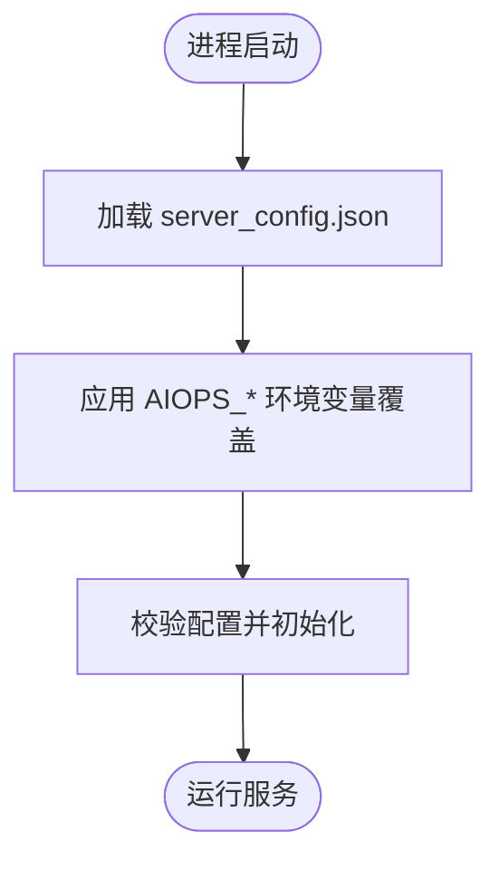
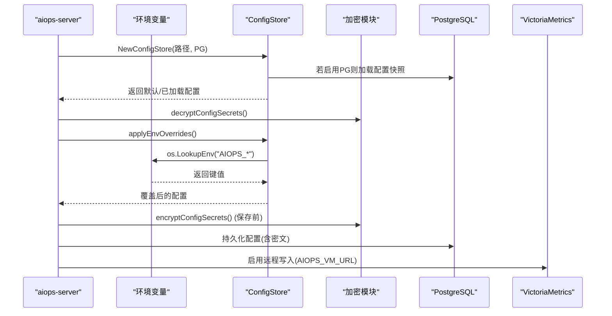

# 环境变量配置

<cite>
**本文引用的文件列表**
- [cmd/server/config.go](file://cmd/server/config.go)
- [cmd/server/crypto.go](file://cmd/server/crypto.go)
- [cmd/agent/main.go](file://cmd/agent/main.go)
- [README.md](file://README.md)
- [server_config.example.json](file://server_config.example.json)
- [config.example.json](file://config.example.json)
- [docker-compose.yml](file://docker-compose.yml)
</cite>

## 目录
1. [简介](#简介)
2. [项目结构与环境变量覆盖机制](#项目结构与环境变量覆盖机制)
3. [核心组件与数据流](#核心组件与数据流)
4. [服务端环境变量清单](#服务端环境变量清单)
5. [Agent 侧环境变量与参数说明](#agent-侧环境变量与参数说明)
6. [命名规范、类型转换与优先级规则](#命名规范类型转换与优先级规则)
7. [使用场景与最佳实践](#使用场景与最佳实践)
8. [容器化与编排部署示例](#容器化与编排部署示例)
9. [敏感信息安全管理](#敏感信息安全管理)
10. [故障排查](#故障排查)
11. [结论](#结论)

## 简介
本文件系统化梳理 AIOps Monitor 在服务端与 Agent 侧的环境变量支持情况，涵盖数据库连接、存储地址、安全密钥、功能开关、网络与安全策略等。文档同时给出命名规范、类型转换、优先级规则以及 Docker/Kubernetes/CI-CD 的落地示例，并提供敏感信息管理的安全建议。

## 项目结构与环境变量覆盖机制
- 服务端在启动时加载配置文件（JSON），随后通过环境变量进行覆盖；布尔型环境变量支持 true/false 或 1/0。
- 关键覆盖逻辑集中在服务端的配置加载流程中，优先读取环境变量，再回落到 JSON 配置。

**图表来源**
- [cmd/server/config.go:588-651](file://cmd/server/config.go#L588-L651)

**章节来源**
- [cmd/server/config.go:588-651](file://cmd/server/config.go#L588-L651)

## 核心组件与数据流
- 配置加载与覆盖：ConfigStore 负责从磁盘或 PostgreSQL 加载配置，并在内存中解密可逆凭据，然后应用环境变量覆盖。
- 静态加密：当设置主密钥后，对可逆凭据（如 SMTP 密码、AI Key、中继密钥等）进行 AES-256-GCM 落库加密；未设置主密钥则保持明文兼容。
- 日志传输加密：基于主密钥派生 per-agent 日志密钥，实现 gzip + AES-256-GCM 的日志上报加密。

**图表来源**
- [cmd/server/config.go:543-651](file://cmd/server/config.go#L543-L651)
- [cmd/server/crypto.go:175-204](file://cmd/server/crypto.go#L175-L204)

**章节来源**
- [cmd/server/config.go:543-651](file://cmd/server/config.go#L543-L651)
- [cmd/server/crypto.go:175-204](file://cmd/server/crypto.go#L175-L204)

## 服务端环境变量清单
以下环境变量用于覆盖服务端配置项，适用于 Docker Compose、Kubernetes ConfigMap/Secret、CI-CD 注入等场景。

- 必填依赖
  - AIOPS_POSTGRES_DSN：PostgreSQL 连接串。未配置将拒绝启动。
  - AIOPS_VM_URL：VictoriaMetrics 地址。未配置将拒绝启动。

- 安全与加密
  - AIOPS_SECRET_KEY：配置主密钥，用于对可逆凭据进行 AES-256-GCM 静态加密。务必妥善备份，丢失将无法解密已存密钥。
  - AIOPS_TLS_CERT / AIOPS_TLS_KEY：可选，配置 HTTPS/TLS 证书与私钥路径。

- 功能开关与网络
  - AIOPS_FORWARD_LISTEN：TCP 转发监听地址（Docker 部署需设为 0.0.0.0）。
  - AIOPS_FORWARD_PORT_RANGE：TCP 转发端口范围，如 10100-10300。
  - AIOPS_RELAY_SECRET：中继节点共享密钥。
  - AIOPS_FORWARD_DISABLED：全局禁用端口转发（true/false 或 1/0）。
  - AIOPS_TERMINAL_DISABLED：全局禁用远程终端（true/false 或 1/0）。
  - AIOPS_ALLOW_ANONYMOUS_AGENTS：允许无 Token Agent（true/false 或 1/0）。
  - AIOPS_TRUST_PROXY：信任反向代理客户端 IP 头（true/false 或 1/0）。
  - AIOPS_REQUIRE_TOKEN：强制 Agent Token 校验（true/false 或 1/0）。

- SSRF 出站防护
  - AIOPS_SSRF_STRICT：严格模式，额外拒绝环回与 RFC1918 私网地址（true/false 或 1/0）。

说明
- 布尔类型支持 true/false 或 1/0。
- 优先级：环境变量 > server_config.json。

**章节来源**
- [README.md:556-573](file://README.md#L556-L573)
- [cmd/server/config.go:616-651](file://cmd/server/config.go#L616-L651)
- [cmd/server/crypto.go:28-42](file://cmd/server/crypto.go#L28-L42)

## Agent 侧环境变量与参数说明
Agent 主要采用命令行参数与配置文件（config.json）组合的方式完成配置，当前代码未提供独立的 AIOPS_ 环境变量覆盖机制。Agent 侧相关要点如下：

- 配置文件字段（config.json）
  - server：单服务端地址（servers 为空时回退到此）。
  - servers：多服务端列表，每项含 server + token；非空时优先使用。
  - report_interval：基础指标上报间隔（秒）。
  - plugin_interval：插件执行周期（秒）。
  - disk_path：主磁盘路径。
  - plugins_dir：插件目录。
  - python：Python 解释器。
  - state_file：Agent 状态文件（含 host_id）。
  - category：主机分类。
  - token：安装 Token（可选）。
  - relay：网关中继模式。
  - listen：Relay 监听地址。
  - relay_secret：Relay 共享密钥。
  - log_paths：采集的日志文件或目录路径（逗号分隔）。
  - log_encrypt：是否开启日志加密上报（gzip+AES-256-GCM），默认开启。
  - tls_skip_verify：跳过服务端 TLS 证书校验（不安全，仅自签/内网临时使用）。
  - ca_cert：信任的 CA 证书路径（PEM），用于校验自签名服务端证书。

- 命令行参数（覆盖配置文件）
  - --server、--interval、--plugin-interval、--disk-path、--plugins-dir、--python、--category、--token、--relay、--listen、--relay-secret、--config、--log-paths、--log-encrypt、--tls-skip-verify、--ca-cert、--security-mode。

- 平台相关环境变量（仅影响默认行为）
  - SystemDrive（Windows）：用于默认磁盘路径推导。
  - COMSPEC（Windows）：用于 Shell 解析。
  - HOME / USERPROFILE（跨平台）：用于终端会话目录推导。
  - SHELL（类 Unix）：用于 Shell 选择。

注意
- 上述平台相关环境变量为系统级，并非 AIOps 专用配置项。
- Agent 未实现 AIOPS_ 前缀的环境变量覆盖，如需集中管理，建议使用编排工具注入到 config.json 或通过脚本生成配置文件。

**章节来源**
- [config.example.json:1-16](file://config.example.json#L1-L16)
- [cmd/agent/main.go:24-42](file://cmd/agent/main.go#L24-L42)
- [cmd/agent/main.go:92-112](file://cmd/agent/main.go#L92-L112)
- [cmd/agent/main.go:64-72](file://cmd/agent/main.go#L64-L72)
- [cmd/agent/main.go:200-238](file://cmd/agent/main.go#L200-L238)

## 命名规范、类型转换与优先级规则
- 命名规范
  - 服务端统一使用 AIOPS_ 前缀，例如 AIOPS_POSTGRES_DSN、AIOPS_VM_URL、AIOPS_SECRET_KEY、AIOPS_FORWARD_LISTEN 等。
  - Agent 侧未引入 AIOPS_ 前缀的环境变量覆盖，主要通过配置文件与命令行参数。

- 类型转换
  - 字符串：直接赋值。
  - 布尔：支持 true/false 或 1/0。
  - 其他类型（如端口范围）按约定格式解析（如 min-max）。

- 优先级
  - 服务端：环境变量 > server_config.json > 默认值。
  - Agent：命令行参数 > 配置文件 > 默认值。

**章节来源**
- [cmd/server/config.go:616-651](file://cmd/server/config.go#L616-L651)
- [cmd/agent/main.go:92-112](file://cmd/agent/main.go#L92-L112)

## 使用场景与最佳实践
- 生产环境
  - 必须配置 AIOPS_POSTGRES_DSN 与 AIOPS_VM_URL。
  - 强烈建议设置 AIOPS_SECRET_KEY，并对所有可逆凭据进行静态加密。
  - 启用 AIOPS_REQUIRE_TOKEN=true，禁止匿名 Agent。
  - 根据部署方式设置 AIOPS_FORWARD_LISTEN=0.0.0.0（Docker）并确保端口范围映射一致。
  - 在可信反向代理后启用 AIOPS_TRUST_PROXY=true。

- 开发/测试环境
  - 可使用默认值快速启动，但建议至少配置 AIOPS_POSTGRES_DSN 与 AIOPS_VM_URL。
  - 调试时可关闭日志加密（Agent --log-encrypt=false），但不建议在生产使用。

- 安全加固
  - 使用 AIOPS_SECRET_KEY 对 MFA/SMTP/AI/webhook/relay 等凭据进行静态加密。
  - 启用 TLS（AIOPS_TLS_CERT/AIOPS_TLS_KEY）或在反向代理层终止 TLS。
  - 谨慎使用 AIOPS_ALLOW_ANONYMOUS_AGENTS，仅在隔离环境中开放。

**章节来源**
- [README.md:556-573](file://README.md#L556-L573)
- [cmd/server/crypto.go:28-42](file://cmd/server/crypto.go#L28-L42)

## 容器化与编排部署示例
- Docker Compose
  - 通过 environment 注入 AIOPS_* 环境变量，无需修改 server_config.json。
  - 示例片段（节选）：
    - aiops-server 服务中设置 AIOPS_POSTGRES_DSN、AIOPS_VM_URL、AIOPS_SECRET_KEY、AIOPS_FORWARD_LISTEN、AIOPS_FORWARD_PORT_RANGE、AIOPS_REQUIRE_TOKEN 等。
    - 参考 docker-compose.yml 中的 services.aiops-server 段。

- Kubernetes
  - 使用 Secret 管理敏感信息（AIOPS_SECRET_KEY、AIOPS_POSTGRES_DSN 等），并通过 envFrom 或 env 注入到 Pod。
  - 使用 ConfigMap 管理非敏感配置（AIOPS_VM_URL、AIOPS_FORWARD_LISTEN 等）。
  - 确保 Service 暴露 8529 端口，并根据需要暴露转发端口范围。

- CI/CD
  - 在 GitHub Actions 或其他流水线中，通过 Secrets 注入 AIOPS_SECRET_KEY、AIOPS_POSTGRES_DSN、AIOPS_VM_URL 等。
  - 构建镜像后，在部署阶段注入环境变量并拉起服务。

提示
- Docker 部署时，forward_listen 已通过 AIOPS_FORWARD_LISTEN 设置为 0.0.0.0，确保宿主机可访问转发端口。
- 端口转发范围默认 10100-10300，需在编排文件中正确映射。

**章节来源**
- [docker-compose.yml:43-53](file://docker-compose.yml#L43-L53)
- [README.md:222](file://README.md#L222)

## 敏感信息安全管理
- 静态加密
  - 设置 AIOPS_SECRET_KEY 后，服务端会对可逆凭据（MFA/TOTP 种子、SMTP 密码、AI API Key、Webhook 头部、中继密钥等）进行 AES-256-GCM 加密落库。
  - 未设置主密钥时，仍保持向后兼容（明文存储）。

- 日志传输加密
  - 基于主密钥派生 per-agent 日志密钥，实现 gzip + AES-256-GCM 的日志上报加密。
  - 未设置主密钥时，日志走明文（兼容/调试）。

- 密钥管理与轮换
  - 主密钥变更无需重启即可生效（每次调用重新派生），但历史密文需以新主密钥解密。
  - 务必备份 AIOPS_SECRET_KEY，否则无法解密已存储的凭据。

- 传输加密
  - 可选 TLS（AIOPS_TLS_CERT/AIOPS_TLS_KEY），或置于反向代理层终止 TLS。
  - Agent 支持自签 CA 信任（--ca-cert）与跳过校验（--tls-skip-verify，仅内网/自签）。

- SSRF 防护
  - 默认拒绝云元数据与链路本地地址；设置 AIOPS_SSRF_STRICT=true 可额外拒绝环回与 RFC1918 私网。

**章节来源**
- [cmd/server/crypto.go:28-42](file://cmd/server/crypto.go#L28-L42)
- [cmd/server/crypto.go:175-204](file://cmd/server/crypto.go#L175-L204)
- [cmd/server/crypto.go:120-173](file://cmd/server/crypto.go#L120-L173)
- [README.md:872-875](file://README.md#L872-L875)

## 故障排查
- 启动失败
  - 检查 AIOPS_POSTGRES_DSN 与 AIOPS_VM_URL 是否正确配置。
  - 确认 PostgreSQL 与 VictoriaMetrics 可达且版本兼容。

- 转发端口不可用
  - 确认 AIOPS_FORWARD_LISTEN 是否为 0.0.0.0（Docker 环境）。
  - 核对 AIOPS_FORWARD_PORT_RANGE 与编排文件的 ports 映射一致。

- 匿名 Agent 被拒绝
  - 确认 AIOPS_REQUIRE_TOKEN 与 AIOPS_ALLOW_ANONYMOUS_AGENTS 的设置是否符合预期。

- 反向代理 IP 识别异常
  - 在可信反向代理后启用 AIOPS_TRUST_PROXY=true。

- 静态加密凭据不可用
  - 确认 AIOPS_SECRET_KEY 已正确设置且未被篡改。
  - 检查日志中关于解密失败的错误信息。

**章节来源**
- [cmd/server/config.go:616-651](file://cmd/server/config.go#L616-L651)
- [cmd/server/crypto.go:73-103](file://cmd/server/crypto.go#L73-L103)

## 结论
- 服务端通过 AIOPS_* 环境变量实现对 server_config.json 的灵活覆盖，满足容器化与编排部署需求。
- Agent 侧以配置文件与命令行参数为主，暂未提供 AIOPS_ 环境变量覆盖机制。
- 生产环境应启用静态加密与必要的功能开关，结合反向代理与 TLS 保障传输安全。
- 建议在 CI/CD 与编排系统中集中管理敏感信息，遵循最小权限与隔离原则。