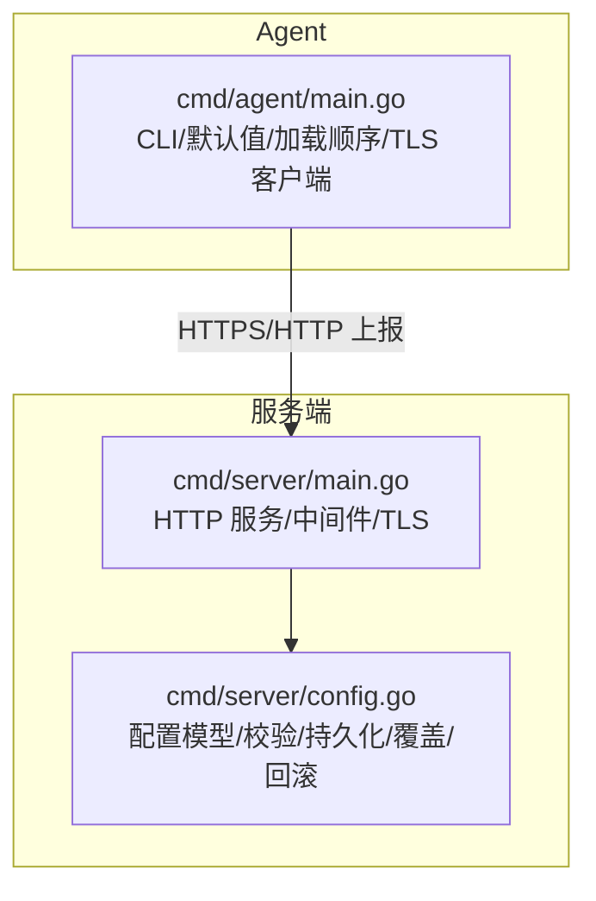
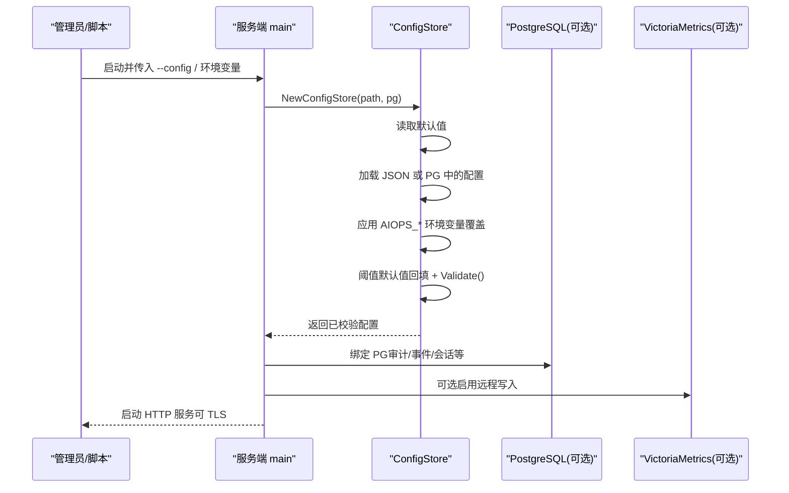
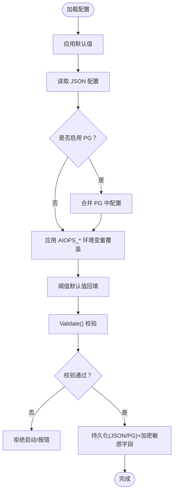
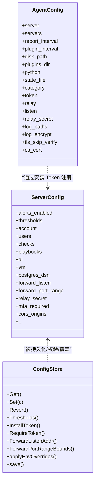

# 配置管理

<cite>
**本文引用的文件**   
- [cmd/server/main.go](file://cmd/server/main.go)
- [cmd/server/config.go](file://cmd/server/config.go)
- [cmd/agent/main.go](file://cmd/agent/main.go)
- [config.example.json](file://config.example.json)
- [server_config.example.json](file://server_config.example.json)
</cite>

## 目录
1. [简介](#简介)
2. [项目结构](#项目结构)
3. [核心组件](#核心组件)
4. [架构总览](#架构总览)
5. [详细组件分析](#详细组件分析)
6. [依赖关系分析](#依赖关系分析)
7. [性能与调优建议](#性能与调优建议)
8. [故障排查指南](#故障排查指南)
9. [结论](#结论)
10. [附录：配置示例与最佳实践](#附录配置示例与最佳实践)

## 简介
本文件面向运维与平台工程师，系统性说明 AIOps Monitor 服务端与 Agent 的配置体系，包括基础参数、高级选项、安全策略、性能调优、优先级规则、动态更新机制、验证与回滚能力，并提供多场景配置示例与常见问题排查方法。

## 项目结构
- 服务端（Server）
  - 启动入口与中间件、TLS、CORS、请求体限制等由主程序负责；配置加载、校验、持久化、环境变量覆盖、热重载相关逻辑集中在配置模块。
- Agent
  - 负责采集与上报，支持单/多后端服务器、中继模式、日志采集与加密上报、TLS 信任链配置等。

图表来源
- [cmd/server/main.go:227-355](file://cmd/server/main.go#L227-L355)
- [cmd/server/config.go:543-599](file://cmd/server/config.go#L543-L599)
- [cmd/agent/main.go:74-136](file://cmd/agent/main.go#L74-L136)

章节来源
- [cmd/server/main.go:227-355](file://cmd/server/main.go#L227-L355)
- [cmd/server/config.go:543-599](file://cmd/server/config.go#L543-L599)
- [cmd/agent/main.go:74-136](file://cmd/agent/main.go#L74-L136)

## 核心组件
- 服务端配置模型与存储
  - 包含告警阈值、通知渠道（飞书/钉钉/自定义 Webhook/SMTP/SMS/语音）、账户与 MFA、拨测检查、端口转发、代理、数据源、SLO、AI 配置、VictoriaMetrics 写入、PostgreSQL DSN、CORS、MFA 强制策略、Relay 共享密钥、TrustProxy 等。
  - 提供配置校验、默认值回填、环境变量覆盖、持久化（JSON 文件或 PostgreSQL）、回滚快照、敏感字段静态加密等能力。
- Agent 配置模型与加载
  - 支持单/多后端服务器、上报周期、插件周期、磁盘路径、插件目录、Python 解释器、分类标签、安装 Token、中继模式、监听地址、中继密钥、日志采集路径、日志加密、TLS 跳过校验与 CA 证书等。

章节来源
- [cmd/server/config.go:407-489](file://cmd/server/config.go#L407-L489)
- [cmd/server/config.go:503-531](file://cmd/server/config.go#L503-L531)
- [cmd/server/config.go:543-599](file://cmd/server/config.go#L543-L599)
- [cmd/server/config.go:616-651](file://cmd/server/config.go#L616-L651)
- [cmd/server/config.go:1046-1076](file://cmd/server/config.go#L1046-L1076)
- [cmd/agent/main.go:24-42](file://cmd/agent/main.go#L24-L42)
- [cmd/agent/main.go:44-62](file://cmd/agent/main.go#L44-L62)
- [cmd/agent/main.go:74-136](file://cmd/agent/main.go#L74-L136)

## 架构总览
配置在启动时按“默认值 → 配置文件 → 命令行参数/环境变量”的顺序合并，随后进行校验与必要回填，再持久化到 JSON 文件或 PostgreSQL。运行时通过 API 修改配置会触发保存与可选的回滚快照。

图表来源
- [cmd/server/main.go:227-355](file://cmd/server/main.go#L227-L355)
- [cmd/server/config.go:543-599](file://cmd/server/config.go#L543-L599)
- [cmd/server/config.go:616-651](file://cmd/server/config.go#L616-L651)

## 详细组件分析

### 服务端配置项详解
- 基础开关与功能
  - alerts_enabled：是否启用告警评估。
  - terminal_disabled / forward_disabled：全局禁用远程终端与端口转发（默认开启）。
  - require_token / allow_anonymous_agents：是否要求 Agent 携带安装 Token（默认要求）。
  - mfa_required：全局强制 MFA 策略。
  - trust_proxy：是否信任反向代理的 X-Real-IP/X-Forwarded-For（直连暴露时默认关闭）。
  - cors_origins：跨域白名单，为空则兼容旧行为允许所有来源。
- 通知渠道
  - feishu/dingtalk/custom_webhook/smtp/sms/voice_call：各渠道开关、连接信息、签名/模板等。
- 告警阈值 thresholds
  - CPU/内存/磁盘/IO/IOPS/GPU/负载/进程数/连接数/离线检测时长等；拨测（Ping/TCP/HTTP/进程）、API 业务监控、编排任务、端口转发均有独立阈值组。
  - 未设置或为 0 的阈值会在加载/保存时自动回填为默认值，避免误报。
- 账户与用户
  - account：初始管理员账户（用户名、显示名、邮箱、密码哈希、MFA 等）。
  - users：多用户列表（RBAC），迁移后保留。
- 拨测与自动化
  - checks：HTTP/TCP/Ping/进程存活检查。
  - playbooks：编排剧本。
  - remediation_rules：修复规则。
  - slos：SLO 定义。
- 外部集成
  - ai：AI 提供商配置（如巡检/诊断）。
  - vm：VictoriaMetrics 远程写入（通常通过环境变量启用）。
  - postgres_dsn：PostgreSQL DSN（通常通过环境变量注入）。
  - data_sources：外部观测数据源（Loki/Prometheus）。
- 端口转发与代理
  - forward_listen / forward_port_range：TCP 转发监听地址与端口范围（默认仅本地可达）。
  - http_proxies：HTTP 快捷代理。
  - forward_rules：持久化的 TCP 转发规则。
- 安全与中继
  - relay_secret：网关中继共享密钥，用于校验上游请求。
  - install_token / prev_install_token / prev_token_expires_at：安装令牌及轮换宽限期。
  - categories：主机分类覆盖映射。

章节来源
- [cmd/server/config.go:407-489](file://cmd/server/config.go#L407-L489)
- [cmd/server/config.go:75-135](file://cmd/server/config.go#L75-L135)
- [cmd/server/config.go:137-172](file://cmd/server/config.go#L137-L172)
- [cmd/server/config.go:181-278](file://cmd/server/config.go#L181-L278)
- [cmd/server/config.go:318-350](file://cmd/server/config.go#L318-L350)
- [cmd/server/config.go:352-376](file://cmd/server/config.go#L352-L376)
- [cmd/server/config.go:391-405](file://cmd/server/config.go#L391-L405)
- [cmd/server/config.go:491-500](file://cmd/server/config.go#L491-L500)

### 服务端配置加载、校验与持久化
- 加载顺序
  - 默认值 → JSON 文件 → PostgreSQL（若启用）→ 环境变量覆盖。
- 校验与回填
  - 阈值范围校验（百分比 0-100）、离线检测时长必须为正、SMTP 端口与密码长度校验等。
  - 零值阈值自动回填为默认值，确保每个指标都有合理阈值。
- 持久化
  - 优先写入 PostgreSQL（JSONB 行），否则落盘 JSON 文件，权限收紧至 0o600。
  - 敏感字段（如 SMTP/SMS/VoiceCall/AI 密钥等）支持静态加密存储（需设置主密钥）。
- 回滚
  - Set() 前保存快照，Revert() 可恢复到上一次成功保存前的版本。

图表来源
- [cmd/server/config.go:543-599](file://cmd/server/config.go#L543-L599)
- [cmd/server/config.go:503-531](file://cmd/server/config.go#L503-L531)
- [cmd/server/config.go:1046-1076](file://cmd/server/config.go#L1046-L1076)

章节来源
- [cmd/server/config.go:543-599](file://cmd/server/config.go#L543-L599)
- [cmd/server/config.go:503-531](file://cmd/server/config.go#L503-L531)
- [cmd/server/config.go:1046-1076](file://cmd/server/config.go#L1046-L1076)

### 环境变量覆盖与环境变量清单
- 支持的覆盖项（示例）
  - AIOPS_VM_URL：启用 VictoriaMetrics 远程写入并设置 URL。
  - AIOPS_POSTGRES_DSN：设置 PostgreSQL DSN。
  - AIOPS_FORWARD_LISTEN / AIOPS_FORWARD_PORT_RANGE：覆盖转发监听与端口范围。
  - AIOPS_RELAY_SECRET：设置中继共享密钥。
  - AIOPS_FORWARD_DISABLED / AIOPS_TERMINAL_DISABLED：全局禁用转发/终端。
  - AIOPS_ALLOW_ANONYMOUS_AGENTS / AIOPS_TRUST_PROXY / AIOPS_REQUIRE_TOKEN：安全策略覆盖。
- 注意
  - 环境变量在加载阶段覆盖 JSON/PG 配置，适合容器编排注入敏感或运行期差异配置。

章节来源
- [cmd/server/config.go:616-651](file://cmd/server/config.go#L616-L651)

### 服务端 TLS 与 HTTPS
- 通过环境变量 AIOPS_TLS_CERT 与 AIOPS_TLS_KEY 启用 TLS/HTTPS。
- 未配置时将输出警告并以明文 HTTP 提供服务（建议置于 HTTPS 终止代理之后）。

章节来源
- [cmd/server/main.go:341-351](file://cmd/server/main.go#L341-L351)

### Agent 配置项详解
- 基础连接
  - server：单后端地址（兼容旧配置）。
  - servers：多后端数组（非空时优先于 server+token）。
  - token：安装 Token（兼容旧配置）。
- 采集与插件
  - report_interval：基础指标上报间隔（秒）。
  - plugin_interval：插件执行周期（秒）。
  - disk_path：监控磁盘路径。
  - plugins_dir：Python 插件目录。
  - python：Python 解释器路径。
- 身份与分类
  - category：主机分类标签。
- 中继模式
  - relay：是否以网关中继模式运行。
  - listen：中继监听地址。
  - relay_secret：中继共享密钥。
- 日志采集
  - log_paths：要采集的文件/目录路径（逗号分隔）。
  - log_encrypt：是否对上报日志进行 gzip+AES-256-GCM 加密（默认开启）。
- TLS 客户端
  - tls_skip_verify：跳过服务端证书校验（不安全，仅自签/内网临时使用）。
  - ca_cert：信任的 CA 证书路径（PEM），用于校验自签名服务端证书。

章节来源
- [cmd/agent/main.go:24-42](file://cmd/agent/main.go#L24-L42)
- [cmd/agent/main.go:44-62](file://cmd/agent/main.go#L44-L62)
- [cmd/agent/main.go:74-136](file://cmd/agent/main.go#L74-L136)

### Agent 配置加载顺序与 CLI 覆盖
- 加载顺序
  - 默认值 → 配置文件（--config 指定）→ 命令行参数覆盖。
  - 当 servers 数组存在时，优先于 legacy 的 server+token。
- 关键 CLI 参数
  - --server、--interval、--plugin-interval、--plugins-dir、--python、--disk-path、--category、--token、--relay、--listen、--config、--log-paths、--log-encrypt、--tls-skip-verify、--ca-cert、--security-mode 等。

章节来源
- [cmd/agent/main.go:74-136](file://cmd/agent/main.go#L74-L136)

### 配置优先级总结
- 服务端
  - 默认值 < JSON/PG 配置 < AIOPS_* 环境变量覆盖。
  - 运行时通过 API 修改配置会触发保存与校验，支持回滚。
- Agent
  - 默认值 < 配置文件 < 命令行参数。
  - servers 数组优先于 server+token。

章节来源
- [cmd/server/config.go:543-599](file://cmd/server/config.go#L543-L599)
- [cmd/server/config.go:616-651](file://cmd/server/config.go#L616-L651)
- [cmd/agent/main.go:74-136](file://cmd/agent/main.go#L74-L136)

## 依赖关系分析
- 服务端
  - 主程序负责 HTTP 中间件、TLS、CORS、请求体大小限制、优雅关闭等；配置模块负责加载、校验、持久化、环境变量覆盖、回滚。
  - 存储后端统一为 PostgreSQL（关系型）+ VictoriaMetrics（时序），内置数据库已停用。
- Agent
  - 负责采集、插件执行、日志采集与上报、TLS 客户端信任链配置、中继模式。

图表来源
- [cmd/server/config.go:407-489](file://cmd/server/config.go#L407-L489)
- [cmd/server/config.go:533-599](file://cmd/server/config.go#L533-L599)
- [cmd/agent/main.go:24-42](file://cmd/agent/main.go#L24-L42)

章节来源
- [cmd/server/config.go:407-489](file://cmd/server/config.go#L407-L489)
- [cmd/server/config.go:533-599](file://cmd/server/config.go#L533-L599)
- [cmd/agent/main.go:24-42](file://cmd/agent/main.go#L24-L42)

## 性能与调优建议
- 上报与插件周期
  - 根据主机规模调整 report_interval 与 plugin_interval，避免过高频率导致带宽与 CPU 压力。
- 响应压缩
  - 服务端对文本/JSON 响应启用 gzip 压缩，减少带宽占用；WebSocket/流式接口不受影响。
- 请求体限制
  - 通用请求体上限 100MiB，防止恶意或异常大请求耗尽内存。
- 存储后端
  - 统一使用 PostgreSQL + VictoriaMetrics，避免本地文件存储带来的不一致与恢复风险。
- 转发与代理
  - 端口转发默认仅本地可达，生产环境如需外网访问应显式配置监听地址与端口范围，并结合反向代理与防火墙策略。

章节来源
- [cmd/server/main.go:186-205](file://cmd/server/main.go#L186-L205)
- [cmd/server/main.go:104-145](file://cmd/server/main.go#L104-L145)
- [cmd/server/main.go:255-266](file://cmd/server/main.go#L255-L266)
- [cmd/server/config.go:717-745](file://cmd/server/config.go#L717-L745)

## 故障排查指南
- 启动失败
  - 未配置 AIOPS_POSTGRES_DSN 或 AIOPS_VM_URL：服务端将直接退出并提示需在环境变量中配置。
  - 配置校验失败：阈值不在 0-100、离线检测时长非正、SMTP 端口无效或密码过短等。
- 无法连接服务端
  - Agent 未配置任何服务端地址（--server 或 servers 字段缺失）。
  - TLS 证书问题：建议使用 ca_cert 指定受信任 CA，或在测试环境谨慎使用 tls_skip_verify。
- 中继模式异常
  - 确认 --relay 与 --listen 配置正确，且上游服务端设置了匹配的 relay_secret。
- 配置变更不生效
  - 确认环境变量覆盖是否正确；检查是否通过 API 修改后需要重启某些组件（例如转发监听地址变化可能需要重启）。
- 回滚配置
  - 使用 Revert() 恢复到上次成功保存的版本，避免错误配置导致系统不稳定。

章节来源
- [cmd/server/main.go:255-266](file://cmd/server/main.go#L255-L266)
- [cmd/server/config.go:503-531](file://cmd/server/config.go#L503-L531)
- [cmd/agent/main.go:210-218](file://cmd/agent/main.go#L210-L218)
- [cmd/server/config.go:1008-1022](file://cmd/server/config.go#L1008-L1022)

## 结论
AIOps Monitor 的配置体系围绕“安全、可观测、易运维”的目标设计：服务端提供完善的校验、回填、覆盖与回滚能力；Agent 支持灵活的多后端与中继模式，并具备日志加密与 TLS 信任链配置。结合环境变量与 API 的动态更新，可在保证稳定性的前提下实现快速迭代与精细化治理。

## 附录：配置示例与最佳实践

### 单节点部署
- 服务端
  - 通过环境变量注入 AIOPS_POSTGRES_DSN 与 AIOPS_VM_URL，按需启用 TLS。
  - 保持默认转发监听为本地，必要时通过反向代理暴露。
- Agent
  - 配置 --server 指向服务端地址，设置 --category 便于分组。
  - 合理设置 --interval 与 --plugin-interval，避免高频上报。

章节来源
- [cmd/server/main.go:255-266](file://cmd/server/main.go#L255-L266)
- [cmd/server/main.go:341-351](file://cmd/server/main.go#L341-L351)
- [cmd/agent/main.go:74-136](file://cmd/agent/main.go#L74-L136)

### 多节点集群
- 服务端
  - 使用 PostgreSQL 作为统一关系型存储，VictoriaMetrics 作为时序存储。
  - 通过 AIOPS_FORWARD_LISTEN 与 AIOPS_FORWARD_PORT_RANGE 控制转发监听与端口范围。
- Agent
  - 使用 servers 数组配置多个后端，实现高可用上报。
  - 在中继模式下，通过 --relay 与 --listen 暴露本地中继，内部主机无需直连互联网。

章节来源
- [cmd/server/config.go:616-651](file://cmd/server/config.go#L616-L651)
- [cmd/agent/main.go:210-218](file://cmd/agent/main.go#L210-L218)

### 高可用配置
- 服务端
  - 启用 MFA 强制策略与 RequireToken，严格管控接入。
  - 配置 CORSOrigins 精确白名单，避免跨域滥用。
- Agent
  - 多后端上报与中继模式组合，提升容灾能力。
  - 使用 ca_cert 指定受信任 CA，避免证书校验失败。

章节来源
- [cmd/server/config.go:475-489](file://cmd/server/config.go#L475-L489)
- [cmd/agent/main.go:122-136](file://cmd/agent/main.go#L122-L136)

### 安全加固配置
- 服务端
  - 启用 TLS/HTTPS，禁止明文传输。
  - 设置 RelaySecret 保护中继通道，启用 TrustProxy 仅在可信反向代理后使用。
  - 配置 MFARequired 与 RequireToken，最小权限原则。
- Agent
  - 启用 log_encrypt 加密上报日志。
  - 谨慎使用 tls_skip_verify，推荐配置 ca_cert。

章节来源
- [cmd/server/main.go:341-351](file://cmd/server/main.go#L341-L351)
- [cmd/server/config.go:465-475](file://cmd/server/config.go#L465-L475)
- [cmd/agent/main.go:122-136](file://cmd/agent/main.go#L122-L136)

### 配置文件结构与示例
- Agent 配置示例
  - 参考 [config.example.json](file://config.example.json)，包含 server、servers、report_interval、plugin_interval、disk_path、plugins_dir、python、state_file、category、token 等字段。
- 服务端配置示例
  - 参考 [server_config.example.json](file://server_config.example.json)，包含 alerts_enabled、feishu、dingtalk、thresholds、categories、install_token、require_token、mfa_required、forward_listen、forward_port_range、account、checks 等字段。

章节来源
- [config.example.json:1-16](file://config.example.json#L1-L16)
- [server_config.example.json:1-36](file://server_config.example.json#L1-L36)