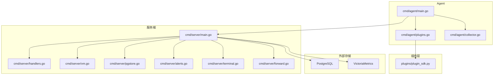
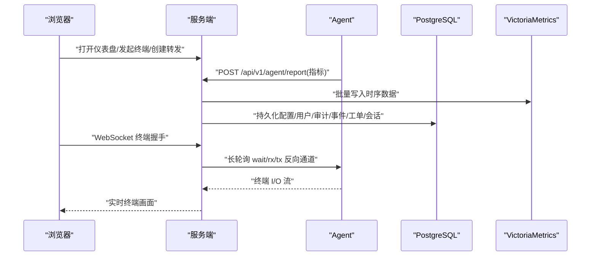
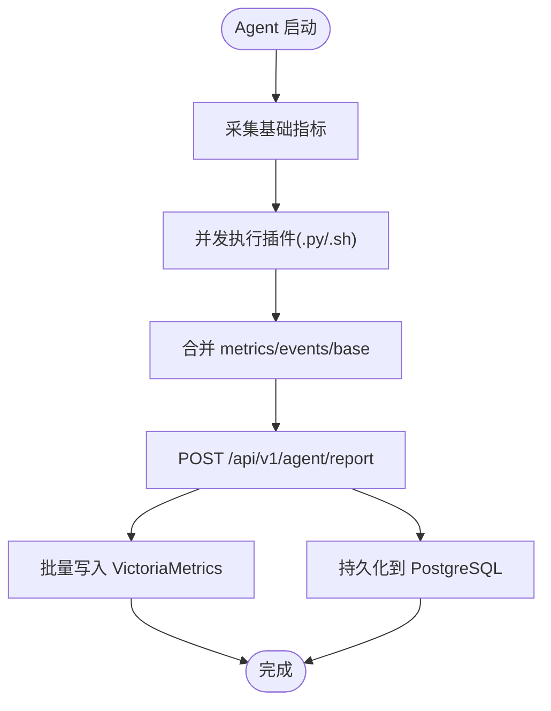
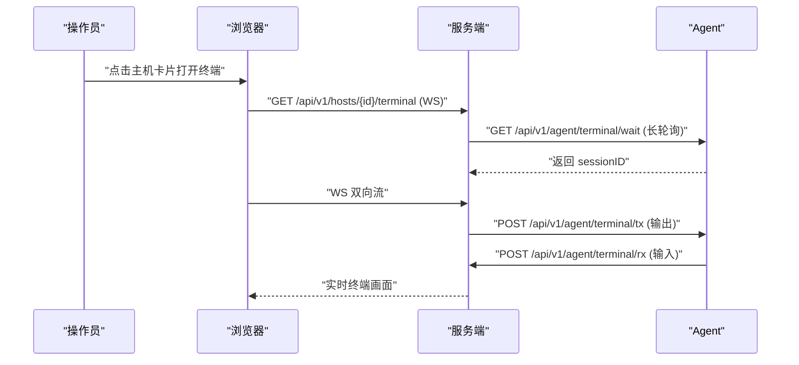
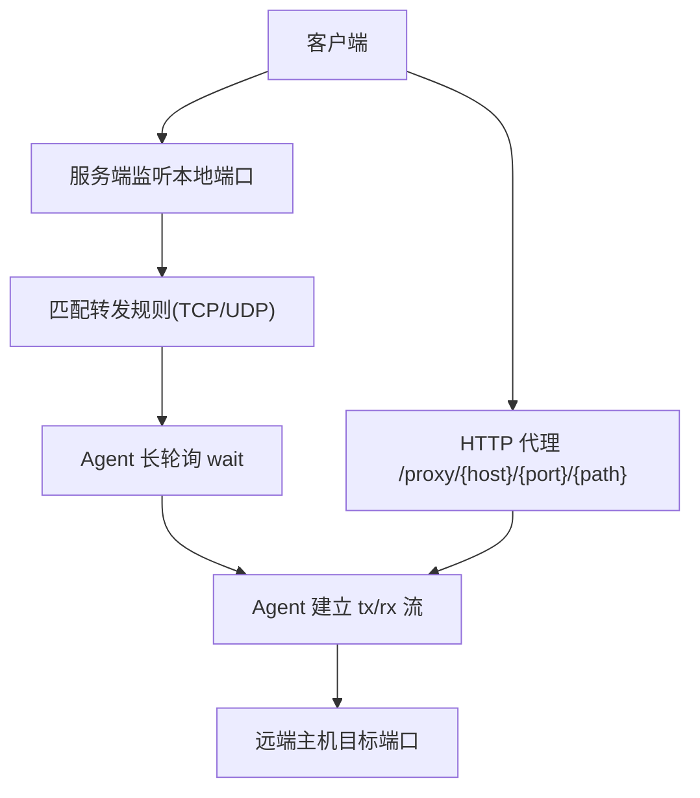
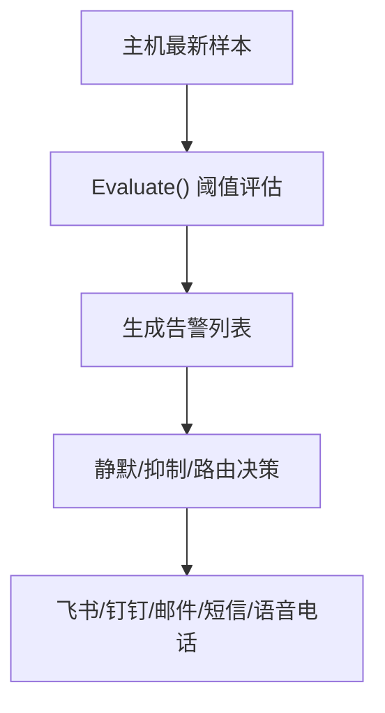
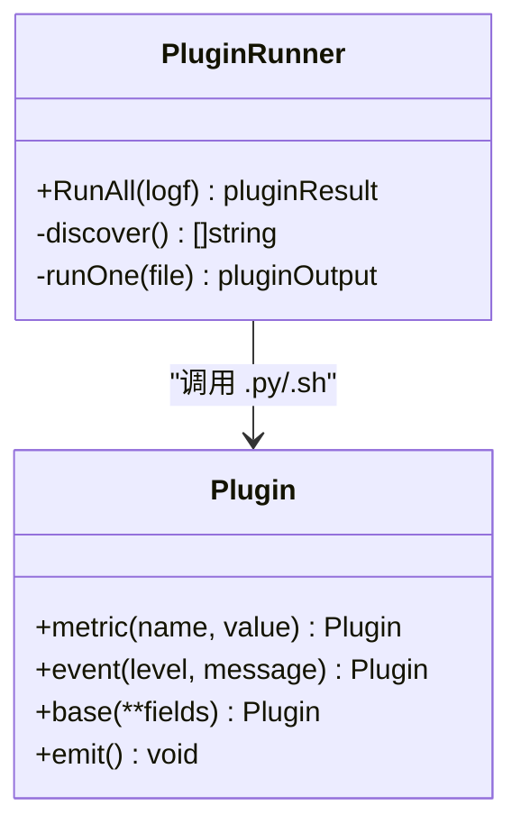
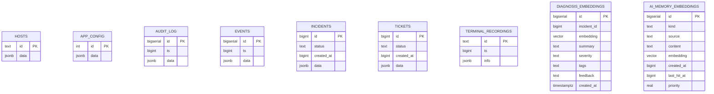
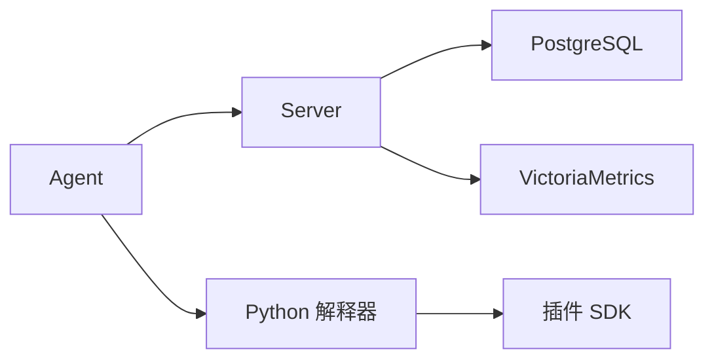

# 项目概述

<cite>
**本文引用的文件**   
- [README.md](file://README.md)
- [cmd/server/main.go](file://cmd/server/main.go)
- [cmd/server/handlers.go](file://cmd/server/handlers.go)
- [cmd/server/vm.go](file://cmd/server/vm.go)
- [cmd/server/pgstore.go](file://cmd/server/pgstore.go)
- [cmd/server/alerts.go](file://cmd/server/alerts.go)
- [cmd/server/terminal.go](file://cmd/server/terminal.go)
- [cmd/server/forward.go](file://cmd/server/forward.go)
- [cmd/agent/main.go](file://cmd/agent/main.go)
- [cmd/agent/plugins.go](file://cmd/agent/plugins.go)
- [cmd/agent/collector.go](file://cmd/agent/collector.go)
- [plugins/plugin_sdk.py](file://plugins/plugin_sdk.py)
- [config.example.json](file://config.example.json)
- [server_config.example.json](file://server_config.example.json)
</cite>

## 目录
1. [简介](#简介)
2. [项目结构](#项目结构)
3. [核心组件](#核心组件)
4. [架构总览](#架构总览)
5. [详细组件分析](#详细组件分析)
6. [依赖关系分析](#依赖关系分析)
7. [性能与规模](#性能与规模)
8. [故障排查指南](#故障排查指南)
9. [结论](#结论)
10. [附录](#附录)

## 简介
AIOps Monitor 是一款企业级主机监控与 SRE 运维平台，采用“Go 原生采集 + Python 插件层 + 实时面板”的混合架构，提供跨平台（Linux/Windows/macOS）指标采集、GPU 监控、自定义拨测、远程终端、自动化剧本、SRE 中枢（事件/自动修复/SLO/工单）、日志采集检索、AI 巡检诊断等能力。v5.5.0 起统一存储为 PostgreSQL（全部关系数据）+ VictoriaMetrics（全部时序数据），内置 aiops.db 已停用；新增配置密钥 AES-256-GCM 静态加密、可选 TLS 传输加密、首次登录强制安全初始化、跨平台开机自启与保活。

目标用户包括：
- 运维工程师与 SRE：主机与业务可用性监控、告警治理、SLO 与事件闭环、自动化修复与工单流转
- 平台与研发：API 监控、端口转发与 HTTP 代理、远程终端、日志检索、AI 辅助诊断
- 安全与合规：RBAC、MFA、审计、SSRF 防护、TLS 与静态加密

与传统监控系统相比，差异化优势在于：
- 单二进制服务端 + 零依赖 Agent，三平台原生采集与 GPU 支持
- Server-Agent 分离部署，Agent 反向连接，免开入站端口
- 统一存储 PG + VM，关系与时序数据各司其职
- 内置 AI 巡检与 RAG 记忆库，结合 pgvector 实现相似案例检索
- 告警治理（静默/抑制/路由）与统一消息中心，降低噪音、提升可操作度

章节来源
- [README.md:1-20](file://README.md#L1-L20)
- [README.md:138-176](file://README.md#L138-L176)

## 项目结构
仓库按功能分层组织：
- cmd/server：服务端主程序、HTTP 路由、中间件、存储对接（PG/VM）、SRE 工作流、AI 模块、终端与转发
- cmd/agent：采集器、插件运行器、平台特定采集实现、日志采集与安全环境检测
- plugins：Python 插件 SDK 与示例插件
- deploy/docker：容器编排与 Nginx 前端配置
- scripts：构建与国际化脚本

图表来源
- [cmd/server/main.go:227-355](file://cmd/server/main.go#L227-L355)
- [cmd/server/handlers.go:96-346](file://cmd/server/handlers.go#L96-L346)
- [cmd/server/vm.go:125-172](file://cmd/server/vm.go#L125-L172)
- [cmd/server/pgstore.go:77-212](file://cmd/server/pgstore.go#L77-L212)
- [cmd/agent/main.go:74-238](file://cmd/agent/main.go#L74-L238)
- [cmd/agent/plugins.go:102-147](file://cmd/agent/plugins.go#L102-L147)
- [cmd/agent/collector.go:5-16](file://cmd/agent/collector.go#L5-L16)
- [plugins/plugin_sdk.py:27-58](file://plugins/plugin_sdk.py#L27-L58)

章节来源
- [cmd/server/main.go:227-355](file://cmd/server/main.go#L227-L355)
- [cmd/server/handlers.go:96-346](file://cmd/server/handlers.go#L96-L346)
- [cmd/agent/main.go:74-238](file://cmd/agent/main.go#L74-L238)

## 核心组件
- 服务端（Server）
  - HTTP 服务与中间件：CORS、安全头、gzip 压缩、请求体限制
  - 路由注册：Agent 上报、终端、转发、拨测、API 监控、SRE、AI、日志、消息中心
  - 存储集成：PostgreSQL（关系数据）、VictoriaMetrics（时序数据）
  - 后台任务：告警评估、拨测、API 监控、Playbook 调度、SLO 评估、AI 巡检、VM 写入
- Agent
  - 多后端推送：一次采集广播到多个服务端
  - 插件系统：并发执行 .py/.sh，输出 metrics/events/base
  - 平台采集：Linux/Windows/macOS 原生接口，GPU best-effort
  - 日志采集：增量 tail，可选 gzip+AES-256-GCM 加密上报
- 插件层（Python）
  - SDK 简化开发：metric/event/base/emit
  - 隔离执行：崩溃/超时不影响 Agent 核心
- 存储层
  - PostgreSQL：用户/配置/审计/事件/工单/会话/向量记忆
  - VictoriaMetrics：主机指标/拨测/API 探测历史趋势

章节来源
- [cmd/server/main.go:227-355](file://cmd/server/main.go#L227-L355)
- [cmd/server/handlers.go:96-346](file://cmd/server/handlers.go#L96-L346)
- [cmd/agent/main.go:210-238](file://cmd/agent/main.go#L210-L238)
- [cmd/agent/plugins.go:102-147](file://cmd/agent/plugins.go#L102-L147)
- [cmd/agent/collector.go:5-16](file://cmd/agent/collector.go#L5-L16)
- [plugins/plugin_sdk.py:27-58](file://plugins/plugin_sdk.py#L27-L58)
- [cmd/server/vm.go:125-172](file://cmd/server/vm.go#L125-L172)
- [cmd/server/pgstore.go:77-212](file://cmd/server/pgstore.go#L77-L212)

## 架构总览
整体采用 Server-Agent 分离模式：
- Agent 主动上报基础指标与插件结果至服务端
- 服务端将时序数据批量写入 VictoriaMetrics，关系数据落 PostgreSQL
- 浏览器通过 WebSocket 与 Agent 建立反向通道，实现远程终端与端口转发
- 告警引擎基于阈值规则评估，触发后进入通知与治理流程

图表来源
- [cmd/server/handlers.go:96-346](file://cmd/server/handlers.go#L96-L346)
- [cmd/server/vm.go:125-172](file://cmd/server/vm.go#L125-L172)
- [cmd/server/pgstore.go:77-212](file://cmd/server/pgstore.go#L77-L212)
- [cmd/server/terminal.go:438-516](file://cmd/server/terminal.go#L438-L516)

章节来源
- [cmd/server/main.go:227-355](file://cmd/server/main.go#L227-L355)
- [cmd/server/handlers.go:96-346](file://cmd/server/handlers.go#L96-L346)
- [cmd/server/vm.go:125-172](file://cmd/server/vm.go#L125-L172)
- [cmd/server/pgstore.go:77-212](file://cmd/server/pgstore.go#L77-L212)
- [cmd/server/terminal.go:438-516](file://cmd/server/terminal.go#L438-L516)

## 详细组件分析

### 数据采集与上报（Agent → Server → VM/PG）
- Agent 周期采集 CPU/内存/磁盘/网络/TCP/负载/进程/运行时长/GPU
- 插件并发执行，合并 metrics/events/base
- 服务端接收报告后：
  - 批量写入 VM（Prometheus text exposition）
  - 更新内存态并持久化到 PG（配置/用户/审计/事件/工单/会话）
  - 启动告警评估、拨测、API 监控、SLO、AI 巡检等后台任务

图表来源
- [cmd/agent/main.go:210-238](file://cmd/agent/main.go#L210-L238)
- [cmd/agent/plugins.go:102-147](file://cmd/agent/plugins.go#L102-L147)
- [cmd/server/vm.go:125-172](file://cmd/server/vm.go#L125-L172)
- [cmd/server/pgstore.go:77-212](file://cmd/server/pgstore.go#L77-L212)

章节来源
- [cmd/agent/main.go:210-238](file://cmd/agent/main.go#L210-L238)
- [cmd/agent/plugins.go:102-147](file://cmd/agent/plugins.go#L102-L147)
- [cmd/server/vm.go:125-172](file://cmd/server/vm.go#L125-L172)
- [cmd/server/pgstore.go:77-212](file://cmd/server/pgstore.go#L77-L212)

### 远程终端（浏览器 ↔ Server ↔ Agent）
- 浏览器通过 WebSocket 与服务端交互
- 服务端通过 Agent 反向长轮询 wait/rx/tx 建立双向流
- 支持多标签、会话录制回放、只读旁观、命令审计、二次认证
- 使用机器指纹鉴权，Token 轮换不影响已安装 Agent

图表来源
- [cmd/server/handlers.go:105-109](file://cmd/server/handlers.go#L105-L109)
- [cmd/server/terminal.go:438-516](file://cmd/server/terminal.go#L438-L516)
- [cmd/server/terminal.go:619-696](file://cmd/server/terminal.go#L619-L696)

章节来源
- [cmd/server/handlers.go:105-109](file://cmd/server/handlers.go#L105-L109)
- [cmd/server/terminal.go:438-516](file://cmd/server/terminal.go#L438-L516)
- [cmd/server/terminal.go:619-696](file://cmd/server/terminal.go#L619-L696)

### 端口转发与 HTTP 代理
- TCP/UDP 端口映射：服务端监听本地端口，经 Agent 隧道转发到远端主机
- HTTP 反向代理：无状态代理 /proxy/{hostID}/{port}/{path}，支持 WebSocket
- 支持端口范围批量转发（单批 ≤100），整组启停/编辑/复制
- 统计活跃会话、带宽、错误率、平均延迟，支持告警阈值

图表来源
- [cmd/server/handlers.go:243-256](file://cmd/server/handlers.go#L243-L256)
- [cmd/server/forward.go:567-641](file://cmd/server/forward.go#L567-L641)
- [cmd/server/forward.go:500-526](file://cmd/server/forward.go#L500-L526)

章节来源
- [cmd/server/handlers.go:243-256](file://cmd/server/handlers.go#L243-L256)
- [cmd/server/forward.go:567-641](file://cmd/server/forward.go#L567-L641)
- [cmd/server/forward.go:500-526](file://cmd/server/forward.go#L500-L526)

### 告警评估与治理
- 阈值定义：CPU/内存/磁盘/IO/IOPS/GPU/负载/进程/连接数/离线判定
- 拨测与 API 监控：Ping/TCP/HTTP/进程存活；API 可用率/P95/吞吐
- 编排任务与端口转发：失败次数/超时/连接数/带宽/错误率/延迟
- 告警治理：静默（时段/星期）、抑制（主因抑衍生）、路由（分流渠道）

图表来源
- [cmd/server/alerts.go:205-464](file://cmd/server/alerts.go#L205-L464)
- [cmd/server/alerts.go:467-516](file://cmd/server/alerts.go#L467-L516)

章节来源
- [cmd/server/alerts.go:205-464](file://cmd/server/alerts.go#L205-L464)
- [cmd/server/alerts.go:467-516](file://cmd/server/alerts.go#L467-L516)

### 插件系统与 SDK
- 插件以独立子进程并发执行，最大并发受信号量控制
- 输出 JSON：metrics/gauges、events/info|warning|critical、base（非 Linux 兜底）
- SDK 简化开发：metric()/event()/base()/emit()

图表来源
- [cmd/agent/plugins.go:102-147](file://cmd/agent/plugins.go#L102-L147)
- [plugins/plugin_sdk.py:27-58](file://plugins/plugin_sdk.py#L27-L58)

章节来源
- [cmd/agent/plugins.go:102-147](file://cmd/agent/plugins.go#L102-L147)
- [plugins/plugin_sdk.py:27-58](file://plugins/plugin_sdk.py#L27-L58)

### 存储设计（PostgreSQL + VictoriaMetrics）
- PostgreSQL：关系数据（配置/用户/审计/事件/工单/会话/向量记忆）
- VictoriaMetrics：时序数据（主机指标/拨测/API 探测历史）
- 启动时校验 DSN 与 VM URL，缺失则拒绝启动
- 批量写入 VM，查询时按时间戳重组样本

图表来源
- [cmd/server/pgstore.go:77-212](file://cmd/server/pgstore.go#L77-L212)

章节来源
- [cmd/server/pgstore.go:77-212](file://cmd/server/pgstore.go#L77-L212)
- [cmd/server/main.go:255-272](file://cmd/server/main.go#L255-L272)

## 依赖关系分析
- 组件耦合
  - Server 对 PG/VM 强依赖（启动校验），对 Agent 弱依赖（上报/终端/转发）
  - Agent 对 Python 解释器与插件目录有依赖
  - 插件与 SDK 解耦，仅约定 stdout JSON 契约
- 外部依赖
  - PostgreSQL（lib/pq）
  - VictoriaMetrics（HTTP 文本导入）
  - 可选：TLS 证书、Nginx 反代、Docker Compose

图表来源
- [cmd/server/main.go:227-355](file://cmd/server/main.go#L227-L355)
- [cmd/agent/main.go:74-238](file://cmd/agent/main.go#L74-L238)
- [cmd/server/pgstore.go:77-212](file://cmd/server/pgstore.go#L77-L212)
- [cmd/server/vm.go:125-172](file://cmd/server/vm.go#L125-L172)

章节来源
- [cmd/server/main.go:227-355](file://cmd/server/main.go#L227-L355)
- [cmd/agent/main.go:74-238](file://cmd/agent/main.go#L74-L238)
- [cmd/server/pgstore.go:77-212](file://cmd/server/pgstore.go#L77-L212)
- [cmd/server/vm.go:125-172](file://cmd/server/vm.go#L125-L172)

## 性能与规模
- 高压缩比：gzip 中间件对 JSON/静态资源压缩，多主机轮询场景带宽节省显著
- 批量写入：VM 写入采用缓冲队列与定时 flush，避免阻塞上报路径
- 并发控制：插件并发上限、终端/转发会话上限、请求体大小限制
- 优雅关闭：HTTP 服务 graceful shutdown，持久化最终刷新

章节来源
- [cmd/server/main.go:147-205](file://cmd/server/main.go#L147-L205)
- [cmd/server/vm.go:125-172](file://cmd/server/vm.go#L125-L172)
- [cmd/server/forward.go:34-40](file://cmd/server/forward.go#L34-L40)
- [cmd/server/main.go:305-323](file://cmd/server/main.go#L305-L323)

## 故障排查指南
- 启动失败
  - 未配置 AIOPS_POSTGRES_DSN 或 AIOPS_VM_URL：检查环境变量与 compose 配置
  - TLS 未配置：生产建议启用或置于 HTTPS 终止代理之后
- 终端不可用
  - 确认 Agent 在线且指纹匹配；检查 notifyAgent 队列与 pendingSessions
  - 查看二级密码设置与验证状态
- 转发异常
  - 检查监听地址与端口范围；确认防火墙与 Docker 端口映射
  - 关注会话空闲超时与错误率告警
- 告警风暴
  - 配置静默/抑制/路由规则；调整阈值档位（保守/标准/宽松）
- 插件问题
  - 检查插件输出 JSON 格式与超时；确保扩展名在白名单内

章节来源
- [cmd/server/main.go:255-272](file://cmd/server/main.go#L255-L272)
- [cmd/server/terminal.go:438-516](file://cmd/server/terminal.go#L438-L516)
- [cmd/server/forward.go:567-641](file://cmd/server/forward.go#L567-L641)
- [cmd/server/alerts.go:205-464](file://cmd/server/alerts.go#L205-L464)
- [cmd/agent/plugins.go:62-100](file://cmd/agent/plugins.go#L62-L100)

## 结论
AIOps Monitor 以 Go 原生采集与 Python 插件扩展为核心，结合统一的 PG+VM 存储与丰富的 SRE 能力，形成一套开箱即用、可扩展、可观测的企业级监控与运维平台。其 Server-Agent 分离、反向通道、跨平台与 GPU 支持、AI 巡检与 RAG 记忆库、告警治理与统一消息中心等特性，使其在复杂生产环境中具备显著的差异化优势。

## 附录

### 配置参考要点
- Agent 配置（config.example.json）
  - server/servers、report_interval、plugin_interval、plugins_dir、python、state_file、category、token
- 服务端配置（server_config.example.json）
  - alerts_enabled、feishu/dingtalk/webhook、thresholds、categories、install_token、require_token、forward_listen/port_range、account、checks
- 环境变量覆盖
  - AIOPS_POSTGRES_DSN、AIOPS_VM_URL、AIOPS_SECRET_KEY、AIOPS_TLS_CERT/AIOPS_TLS_KEY、AIOPS_FORWARD_*、AIOPS_RELAY_SECRET、AIOPS_TERMINAL_DISABLED、AIOPS_ALLOW_ANONYMOUS_AGENTS、AIOPS_TRUST_PROXY、AIOPS_REQUIRE_TOKEN

章节来源
- [config.example.json:1-16](file://config.example.json#L1-L16)
- [server_config.example.json:1-36](file://server_config.example.json#L1-L36)
- [README.md:556-576](file://README.md#L556-L576)