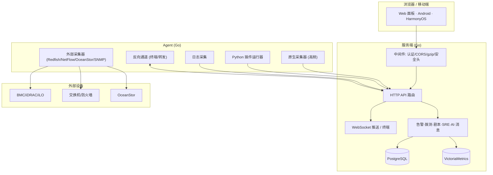

# AIOps

> **企业级主机监控与 SRE 运维平台 · 100% 开源 · 私有化自托管 · 数据永久自持**
>
> 一个 Go 二进制 + 零依赖 Agent，覆盖从指标采集、智能告警、远程终端、自动化自愈，到 SRE 闭环、AI 巡检诊断与安卓/HarmonyOS 移动控制台的运维全链路。PostgreSQL + VictoriaMetrics 双存储，一条命令部署，3 分钟上线。
>
> **English:** AIOps is an open-source, self-hosted enterprise host-monitoring & SRE platform. One Go binary plus a zero-dependency agent covers the full ops loop — metrics, alerting, remote terminal, auto-remediation, SRE closure, AI diagnosis, and a native mobile console — on unified PostgreSQL + VictoriaMetrics storage. MIT licensed.

**语言 / Languages：** [简体中文](README.md) · [English](README_EN.md) · [日本語](README.ja.md) · [한국어](README.ko.md)

---

## 目录

- [项目简介](#项目简介)
- [功能特性](#功能特性)
- [安装步骤](#安装步骤)
- [使用说明](#使用说明)
- [配置参数说明](#配置参数说明)
- [技术架构概述](#技术架构概述)
- [贡献指南](#贡献指南)
- [许可证](#许可证)

---

## 项目简介

AIOps 是一款**企业级主机监控与 SRE 运维平台**，采用「Go 原生采集 + Python 插件层 + 实时面板」的混合架构，提供跨平台（Linux / Windows / macOS / 麒麟等国产系统）指标采集、GPU 监控、自定义拨测、远程终端、自动化剧本、SRE 中枢（事件 / 自动修复 / SLO / 工单）、日志采集检索、AI 巡检诊断等能力。

自 v5.5.0 起统一存储为 **PostgreSQL（全部关系数据）+ VictoriaMetrics（全部时序数据）**，内置的 `aiops.db` 已停用；新增配置密钥 AES-256-GCM 静态加密、可选 TLS 传输加密、首次登录强制安全初始化、跨平台开机自启与保活。

**目标用户**

- **运维工程师与 SRE**：主机与业务可用性监控、告警治理、SLO 与事件闭环、自动化修复与工单流转。
- **平台与研发**：API 监控、端口转发与 HTTP 代理、远程终端、日志检索、AI 辅助诊断。
- **安全与合规**：RBAC、MFA、审计、SSRF 防护、TLS 与静态加密。

**与传统监控方案的差异化优势**

- 单二进制服务端 + 零依赖 Agent，三平台原生采集与 GPU 支持。
- Server-Agent 分离部署，Agent **反向连接**，免开入站端口。
- 统一存储 PG + VM，关系与时序数据各司其职。
- 内置 AI 巡检与 RAG 记忆库，结合 pgvector 实现相似案例检索。
- 告警治理（静默 / 抑制 / 路由）与统一消息中心，降低噪音、提升可操作度。

> 定位上，AIOps 力图用一个你完全掌控的平台，收敛可观测、告警、自动化、AI 诊断、SRE 闭环与移动端 —— 少维护多套分散工具。

---

## 功能特性

### 主机与资源监控

- **跨平台原生采集**：Linux / Windows / macOS / 麒麟等，零第三方依赖。
- **指标维度**：CPU、内存、交换分区、磁盘、进程、端口、网络、DiskIO、IOPS、GPU、负载、运行时长。
- **GPU 监控**：best-effort 采集显存、利用率、温度等。
- **外部采集器（目标设备无需安装 Agent）**：
  - **Redfish**：轮询 BMC / iDRAC / iLO，采集 CPU / 内存 / 存储 / 温度 / 风扇 / 电源 / 固件。
  - **NetFlow**：UDP 接收交换机 / 防火墙 Flow（v5 / v9 模板化）。
  - **华为 OceanStor**：DeviceManager REST 采集存储 / 磁盘柜健康。
  - **SNMP**：手写协议栈（v2c / v3 USM + Trap），纳管交换机 / 路由器。
  - **五元组包报文**、**SNI / DNS 与明文 HTTP 内容审计**（合规可控、默认关闭）。
  - **容器清单**（Docker / Podman 自动探测）、**Hyper-V** 虚拟机采集。

### 日志与可观测

- **日志采集**：增量 tail，可选 gzip + AES-256-GCM 加密上报。
- **全文检索**：日志集中存储与查询。
- **指标趋势**：VictoriaMetrics 承载，原始精度长期保留，可按需聚合查询，长期回溯无压力。

### 拨测与 API 监控

- **自定义拨测**：Ping / TCP / HTTP / 进程存活。
- **API 业务监控**：可用率 / P95 / 吞吐，分布式多地探测（WebSocket 探针）。
- 结果统一写入时序库，可触发告警与 SLO 计算。

### 告警与治理

- **阈值引擎**：CPU / 内存 / 磁盘 / IO / IOPS / GPU / 负载 / 进程 / 连接数 / 离线判定。
- **告警治理**：去重、静默（时段 / 星期）、抑制（主因抑衍生）、路由（分流渠道）。
- **多渠道通知**：飞书、钉钉、邮件、短信、语音电话。
- **恢复通知**与告警生命周期管理。

### 远程终端与端口转发

- **Web 终端**：浏览器 ↔ 服务端 ↔ Agent 反向通道（wait / rx / tx），多标签、会话录制回放、只读旁观、命令审计、二次密码认证。
- **端口转发**：TCP / UDP 映射、HTTP 反向代理（`/proxy/{hostID}/{port}/{path}`，支持 WebSocket），SSRF 出站防护，可全局禁用。
- **机器指纹鉴权**：Token 轮换不影响已安装 Agent。

### 自动化与 SRE 中枢

- **自动化剧本（Playbook）**：多步骤命令，目标选择（全部 / 分类 / 系统 / 主机），并行执行，历史报告。
- **自动修复**：护栏 + 审批流，防止危险操作。
- **事件管理**：汇聚、闭环、案例导出。
- **SLO**：错误预算管理。
- **工单流转**：与事件 / 自动修复联动。
- **统一消息中心**：事件 / 告警 / SLO / 自动修复 / AI / 工单统一收件箱。

### AI 运维能力

- **AI 巡检**：定期自动巡检并产出报告。
- **根因研判**：结合上下文给出诊断建议。
- **RAG 记忆库**：基于 pgvector 的相似案例检索（diagnosis_embeddings / ai_memory_embeddings）。
- **自主 Agent**：Function Calling 执行运维动作。
- **AI Copilot / 语音**：对话式助手与语音交互（TTS / STT）。

### 安全与合规

- **认证**：会话 Cookie + RBAC（admin / operator / viewer）。
- **MFA**：TOTP 动态口令（单次使用）。
- **终端二次密码**：限流 + 锁定时长。
- **Agent 机器指纹**：`X-Agent-Fingerprint`（machine-id + MAC）。
- **安装令牌**：轮换 + 7 天宽限期。
- **中继密钥**：`AIOPS_RELAY_SECRET` 校验来源。
- **静态加密**：配置密钥 AES-256-GCM。
- **传输加密**：可选 TLS；首次登录强制安全初始化。

### 移动端

- **原生 Android App**（Kotlin + Jetpack Compose）：29 条导航路由 / 20+ 屏幕。SRE 驾驶舱、主机详情（原生 Canvas 图表）、告警（级别 / 状态双维筛选 + AI 诊断）、企业级 VT 终端、运维中心（事件 / 审批 / SLO / 工单）、监控拨测、AI 助手（SSE 流式）、硬件 / NetFlow / Hyper-V、终端回放、消息中心等。DataStore 持久化会话，MFA 弹窗，自建 `/ws/push` 长连接推送。
- **HarmonyOS NEXT App**（ArkTS）：与 Android 端「功能 / 信息架构 / 交互闭环」对齐的原生鸿蒙控制台。

### 部署与体验

- **Web 面板**：服务端内嵌 Dashboard，双主题（深色 / 浅色），三语切换（简中 / 繁中 / English）。（营销站点 `website/` 已支持 简中 / 繁中 / English / 日本語 / 한국어 五语）
- **多服务端广播**：一次采集，并发上报到多个服务端（跨机房容灾）。
- **网关中继**：内网仅一台联网机器代理所有上报到云端。

---

## 安装步骤

> 服务端**强依赖** PostgreSQL 与 VictoriaMetrics，二者任一缺失将拒绝启动。

### 方式一：Docker Compose（推荐）

```bash
# 1. 准备配置（按需修改 compose 中的环境变量 / 密码）
cp docker-compose.yml docker-compose.override.yml   # 可选

# 2. 一键拉起 server + victoriametrics + postgres(pgvector)
docker compose up -d

# 3. 访问 http://localhost:8529 ，按提示完成首次安全初始化
```

镜像默认使用华为云 SWR（`swr.cn-east-3.myhuaweicloud.com/sreyun/...`），可替换为自构建镜像。

### 方式二：二进制部署

```bash
# 服务端：设置必需环境变量后直接运行
export AIOPS_POSTGRES_DSN="postgres://aiops:密码@localhost:5432/aiops?sslmode=disable"
export AIOPS_VM_URL="http://localhost:8428"
export AIOPS_LISTEN=":8529"            # 可选，默认 :8529
./aiops-server

# Agent：复制配置并启动
cp config.example.yaml config.yaml
./aiops-agent --config config.yaml
```

### 方式三：源码构建

```bash
# 需要 Go 1.26+（见 go.mod）
go build ./cmd/server ./cmd/agent

# 或使用仓库脚本（Windows 用 build.ps1，含交叉编译；Makefile 含安全门：vet/test/govulncheck/gosec/staticcheck/sbom）
make build          # Linux/macOS
./build.ps1         # Windows
```

安装完成后，在 Web「安装命令」页生成 Agent 安装指令（自动注入 Token），粘贴到目标主机即可纳管。

更详细的安装与配置见 [INSTALL.md](INSTALL.md) 与 [DEPLOY_GUIDE.md](DEPLOY_GUIDE.md)（英文版见 [INSTALL_EN.md](INSTALL_EN.md) / [DEPLOY_GUIDE_EN.md](DEPLOY_GUIDE_EN.md)）。

---

## 使用说明

1. **首次登录**：访问 `http://<服务器>:8529`，首次登录强制修改用户名 + 密码；建议为管理员账户启用 **MFA**。
2. **纳管主机**：在「安装命令」页生成命令 → 目标主机执行 → Agent 反向连接并自动注册；可按 `category`（生产 / 测试 / DB / 办公）分组。
3. **配置监控**：
   - 在「告警」页设置阈值与治理规则（静默 / 抑制 / 路由）。
   - 在「拨测」页添加 Ping / TCP / HTTP / 进程存活任务；在「API 监控」页接入业务接口。
   - 在「剧本」页编排自动修复步骤，按需开启审批护栏。
4. **远程运维**：在主机卡片打开「终端」实时排障（支持录制回放与二次密码）；在「转发」页创建端口转发 / HTTP 代理规则。
5. **SRE 闭环**：事件、SLO、工单在「运维中心」联动；AI 巡检与诊断在「AI 助手」中查看。
6. **移动端**：安装 Android / HarmonyOS App，填入自建服务器地址与账号，钉钉 / 飞书般的推送通过自建 `/ws/push` 长连接送达。
7. **外部设备**：在 Agent `config.yaml` 中填写 `redfish_targets` / `oceanstor_targets` / `netflow` / `snmp` 等，目标设备无需安装 Agent 即被纳管。

---

## 配置参数说明

### 服务端（环境变量覆盖）

| 变量 | 说明 | 必填 |
|---|---|---|
| `AIOPS_POSTGRES_DSN` | PostgreSQL 连接串（关系数据 + 审计 + 事件 + 工单 + pgvector RAG） | 是 |
| `AIOPS_VM_URL` | VictoriaMetrics 地址（时序数据） | 是 |
| `AIOPS_LISTEN` | 服务端监听地址，默认 `:8529` | 否 |
| `AIOPS_SECRET_KEY` | 配置密钥静态加密密钥（AES-256-GCM） | 否（建议生产设置） |
| `AIOPS_TLS_CERT` / `AIOPS_TLS_KEY` | TLS 证书 / 私钥（启用 HTTPS） | 否（建议生产设置） |
| `AIOPS_RELAY_SECRET` | 中继来源校验密钥 | 否 |
| `AIOPS_TERMINAL_DISABLED` | 全局禁用 Web 终端 | 否 |
| `AIOPS_ALLOW_ANONYMOUS_AGENTS` | 允许未鉴权 Agent 接入（仅调试） | 否 |
| `AIOPS_TRUST_PROXY` | 信任前置反代（X-Forwarded-*） | 否 |
| `AIOPS_REQUIRE_TOKEN` | 要求 Agent 携带安装 Token | 否 |
| `AIOPS_FORWARD_*` | 端口转发相关（监听地址 / 端口范围等） | 否 |

服务端另有 `cmd/server/config_example.yaml`（通知 webhook、阈值档位、分类、install_token、转发、账户、checks 等）。

### Agent（`config.yaml` / `config.json`）

| 分组 | 关键参数 | 说明 |
|---|---|---|
| 基础 | `server` / `token` / `category` | 服务端地址、安装 Token、主机分类标签 |
| 上报 | `report_interval` / `plugin_interval` | 指标上报间隔（默认 30s）/ 插件周期（默认 60s） |
| 多服务端 | `servers[]` | 非空时**覆盖**单 server：一次采集并发上报所有服务端 |
| 日志 | `log_paths` / `log_encrypt` | 采集路径（支持通配）/ 是否 gzip+AES 加密上报（默认 true） |
| TLS | `tls_skip_verify` / `ca_cert` | 跳过证书校验（不安全）/ 指定 CA 校验自签 |
| 中继 | `relay` / `listen` / `relay_secret` | 网关模式：内网机器经本网关上报 |
| 硬件 | `redfish_targets` / `oceanstor_targets` | BMC / 华为存储带外采集（目标无需装 Agent） |
| 网络 | `netflow` / `snmp` / `packet_capture` / `sni_dns_capture` | NetFlow / SNMP(v2c/v3+Trap) / 五元组 / SNI-DNS 与内容审计 |
| 虚拟化 | `hyperv_*` / `container_*` | Hyper-V 与容器清单（通常自动探测） |

密码类字段一律优先使用 `*_env` 环境变量（如 `REDFISH_DELL_PASSWORD`），避免明文落盘。完整示例见 [config.example.yaml](config.example.yaml) 与 [cmd/agent/config_example.yaml](cmd/agent/config_example.yaml)。

---

## 技术架构概述

AIOps 采用 **Server-Agent 分离**架构，结合 **Go + Python 混合设计原则**：高频、性能敏感的基础指标采集用 Go（单二进制、零依赖），可变或 AI 依赖的自定义逻辑用 Python 插件。



**关键设计**

- **通信协议**：HTTP REST（Agent 注册 / 上报 / 日志 / 管理 API）；WebSocket（浏览器实时推送与远程终端）；Agent 主动长轮询建立终端 / 转发反向通道。
- **数据流向**：Agent 采集 → 上报服务端 → 关系数据落 PG、时序数据批量写入 VM；浏览器经 REST / WebSocket 获取与下发。
- **双存储强制**：PG（关系 + 审计 + 事件 + 工单 + 会话 + 向量记忆）与 VM（指标 / 趋势），任一缺失拒绝启动。
- **外部采集器**：标准协议远程轮询，目标设备零侵入，仅需网络连通性。
- **多服务端广播**：单 Agent 一次采集并发上报多个服务端，弱网下重试 / 熔断 / gzip 降级。
- **AI / RAG**：可插拔 LLM + pgvector 相似案例检索。

更完整的架构、数据流、性能与故障排查见 [.qoder/repowiki/zh](.qoder/repowiki/zh/content) 中的「架构设计」「核心功能」「故障排除」等文档。

---

## 贡献指南

欢迎贡献代码、文档与翻译！

1. **提交 Issue**：bug、功能建议、文档修正均欢迎，请尽量提供复现步骤与环境信息。
2. **开发环境**：Go 1.26+、Python 3（插件 SDK）。`make build` 构建，`make audit` 运行安全门（vet / test / govulncheck / gosec / staticcheck / sbom）。
3. **代码规范**：
   - Go 代码使用 `gofmt` / `go vet`；新增逻辑请附测试。
   - 服务端零框架、零 CGO；保持单二进制、零第三方依赖的 Agent 原则。
   - 提交信息清晰表达「为什么」。
4. **国际化**：营销网站支持 简中 / 繁中 / English / 日本語 / 한국어 五语，管理面板支持 简中 / 繁中 / English 三语。新增文案请在对应语言字典中同步（营销网站：`website/js/i18n.js` 与 `website/js/i18n-extra.js`；管理面板：`cmd/server/web/` 下 `i18n-dashboard*.js`。面板流程：改权威字典 → 补英文 → 跑 `build_en` / `build_tw` → 校验 parity → `go build` 重嵌）。
5. **提交 PR**：Fork → 分支开发 → 描述变更与测试 → 等待 CI 与评审。
6. **安全漏洞**：请勿公开 Issue，通过私信 / 安全渠道报告，我们将优先处理。
7. **开发者详细规范**见 [.qoder/repowiki/zh/content/开发者指南](.qoder/repowiki/zh/content/开发者指南)。

---

## 许可证

本项目以 **MIT 许可证**开源，详见 [LICENSE](LICENSE)。

- 代码托管于 GitHub，透明可信；无主机数限制、无功能阉割、无「企业版」套路。
- 第三方依赖（如 `vendor/` 下的 `lib/pq`、`go-qrcode`、`ledongthuc/pdf`，以及 `harmony/` 的 ohpm 依赖）遵循各自许可证，归原作者所有。

---

<p align="center">
  <b>AIOps · 把运维的复杂度，收敛进一个你完全掌控的平台。</b>
</p>
